=========================
Assemble Mini Pupper 2
=========================

.. contents::
   :local:
   :depth: 2

1. Standard Kit Main Parts Assembly
#######################################

Step 1 Preparation
---------------------------------

The following picture shows all the parts.

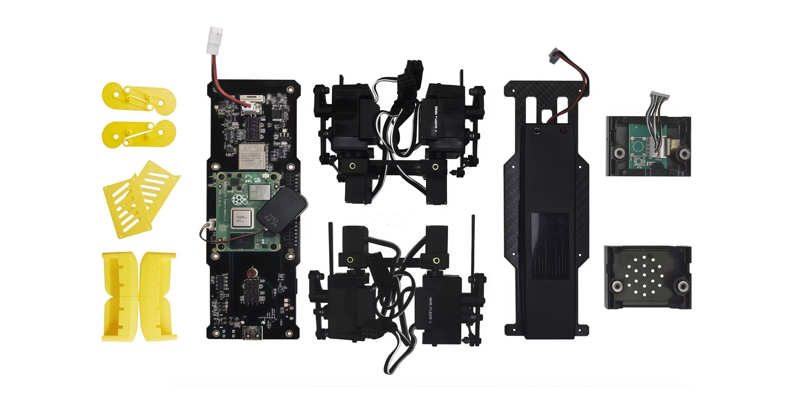

Step 2 Assemble the bottom plate.
------------------------------------

Connect the 4 legs to the bottom plate using the M2 x 5mm screws.

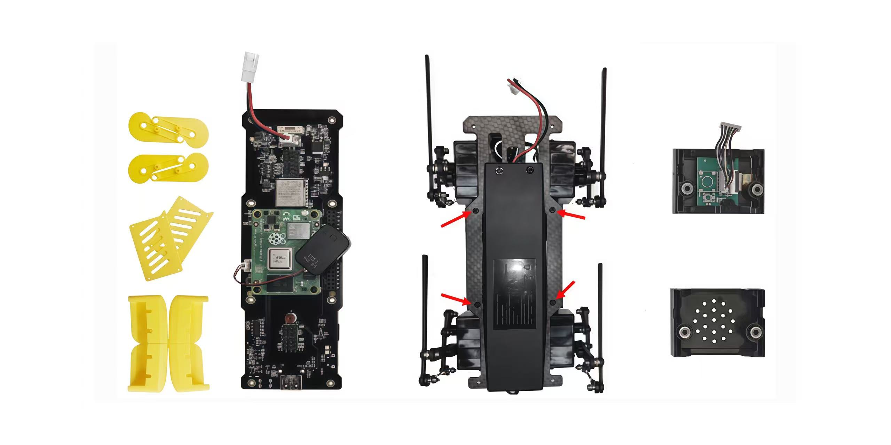

Step 3 Assemble the top PCB board.
------------------------------------

Insert the four-legged connection wire into the top board. Connect the LCD screen cable to the PCB board. Please pay attention to the direction.

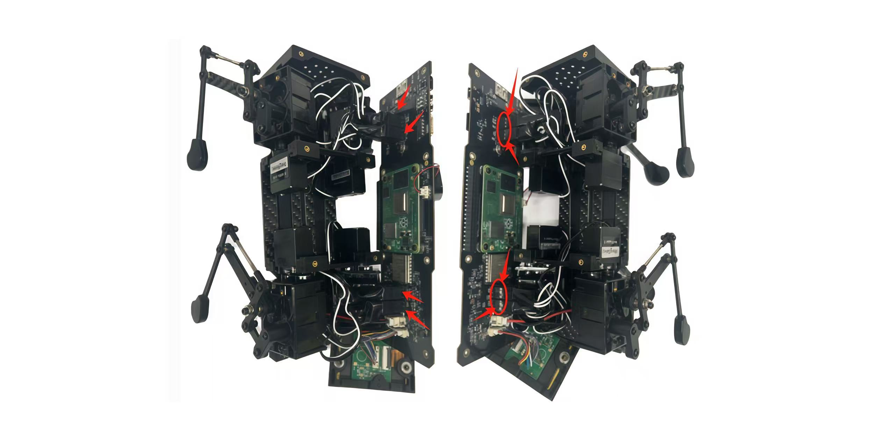

Step 4 Adjust the power line
------------------------------

Pass the power line on the PCB board through the hole in the bottom plate.

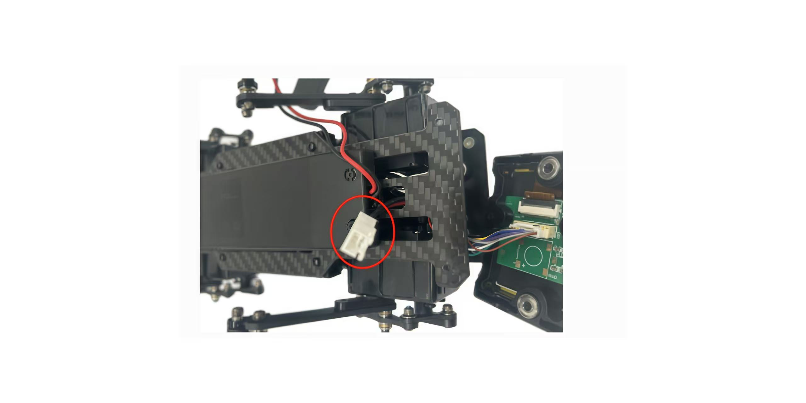

Step 5 Assemble the speaker
------------------------------

Fix the PCB board and bottom board using M2 x 5mm screws.

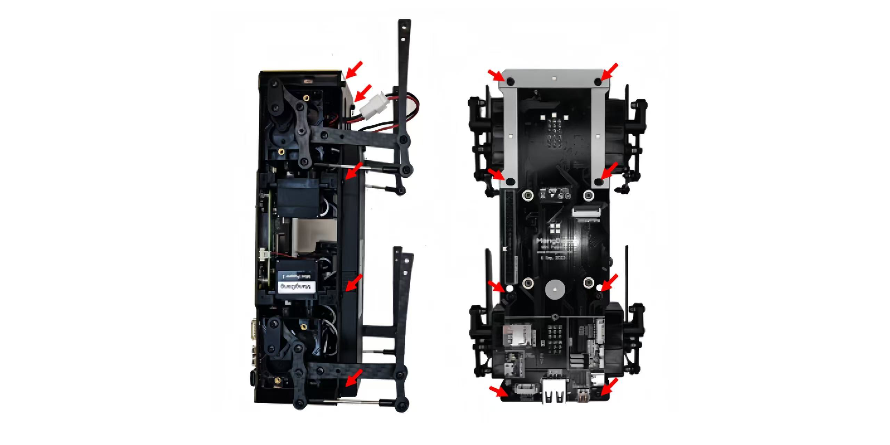

2. Cover Assembly
##################
Please refer to the below video clip.

.. raw:: html

    

        <iframe width="685" height="385" src="https://www.youtube.com/embed/Nw8dl4CGt9A?mute=1" frameborder="0" allow="accelerometer; autoplay; encrypted-media; gyroscope; picture-in-picture" allowfullscreen></iframe>
    

|

Step 1 Side panels
---------------------------------------

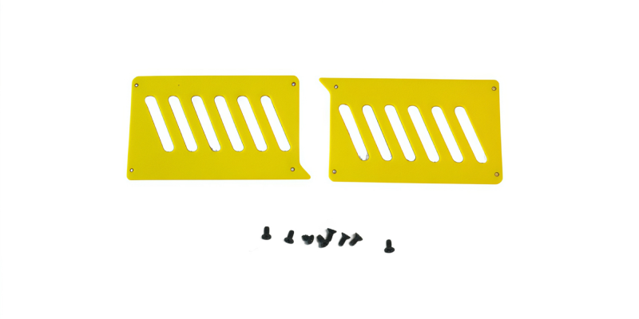

Step 2 Shin guards
---------------------------------------

* Use four M2x10mm countersunk screws.

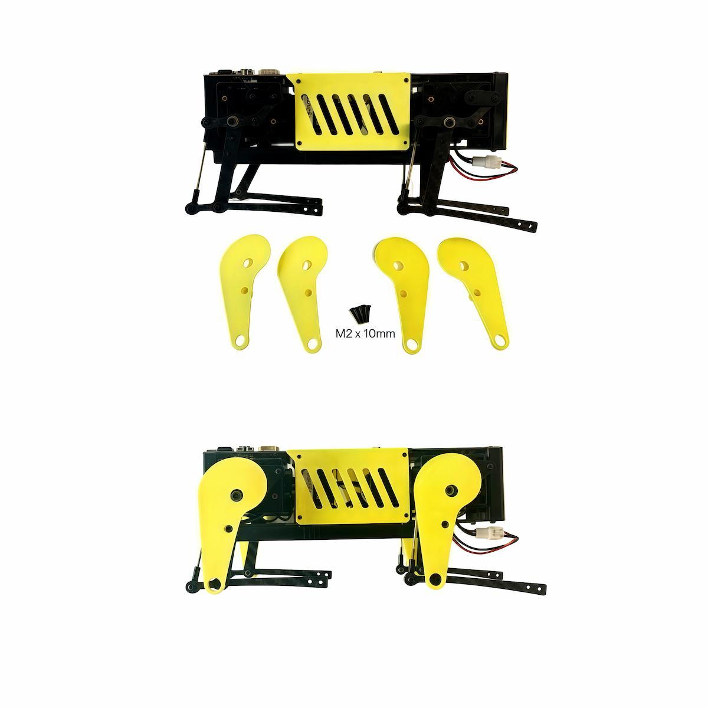

Step 3 Shoulders
---------------------------------------

* Insert only the screws first and then insert the shoulder parts into the gap. Insert the 2 mm hex driver into the hole in the shoulder part and tighten the screws.

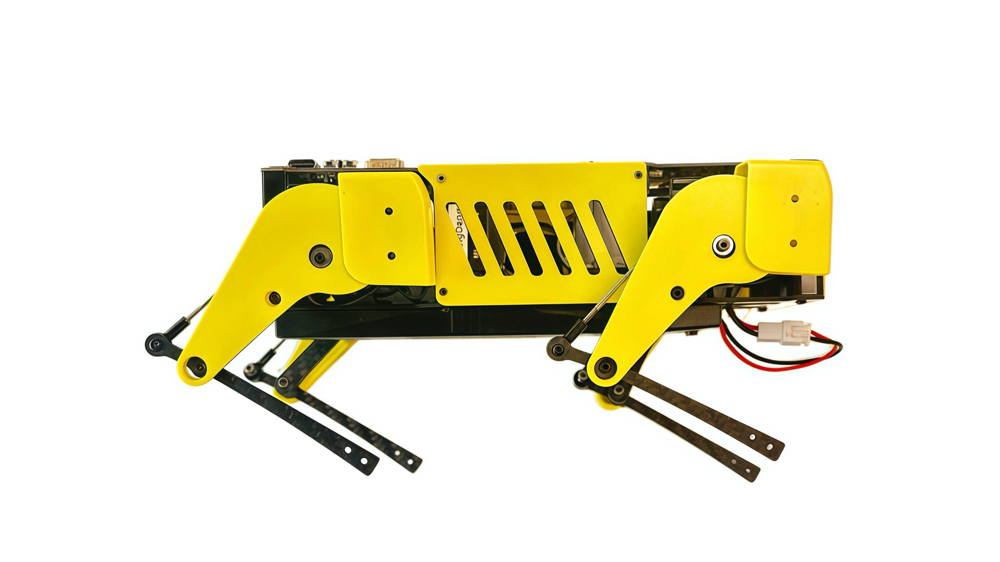

Step 4 Shoes
---------------------------------------

* Put on 4 shoes.

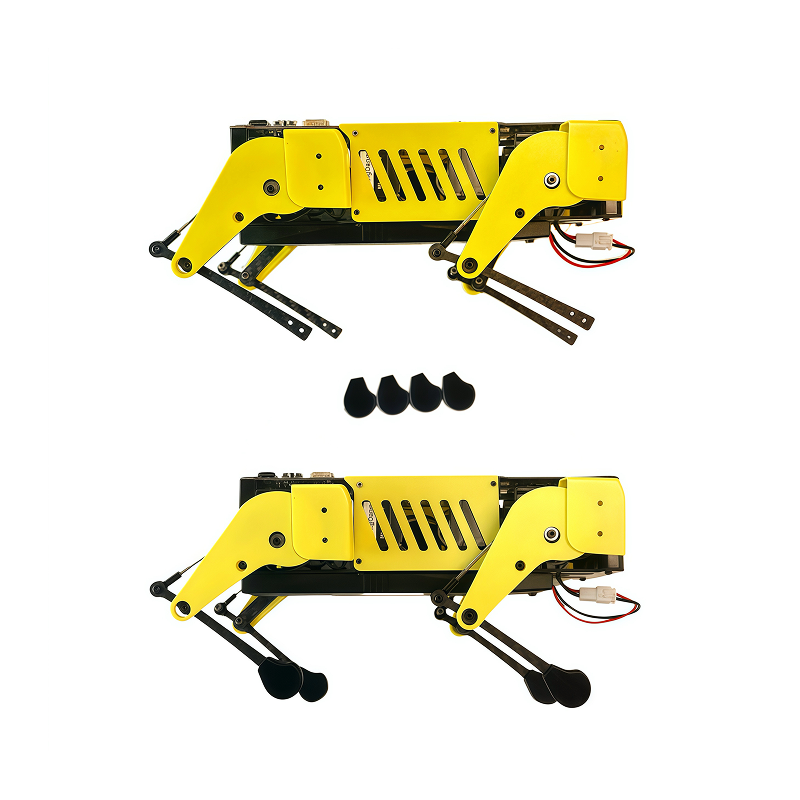

Complete!
----------

3. Add-On Assembly
###################

Step 1 Lidar
---------------------------------------

If you order the Lidar, the 3D-printed Lidar holder and custom cable will be shipped together. You can also print the holder by yourself using the  `STL files <https://drive.google.com/drive/folders/1YyU4w-Ry1G25047BGe2m4Fi_TPRtYV0c?usp=sharing>`_

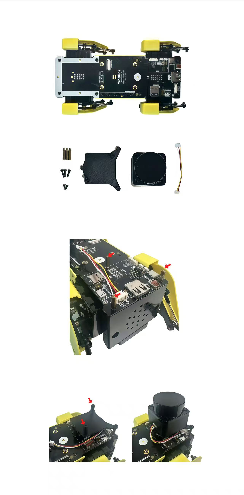

Connect the 3 holders to the 3D-printed part.

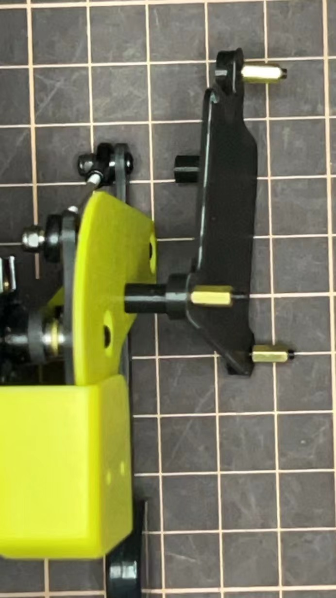

Connect the custom cable to the Lidar connector on the PCB board.

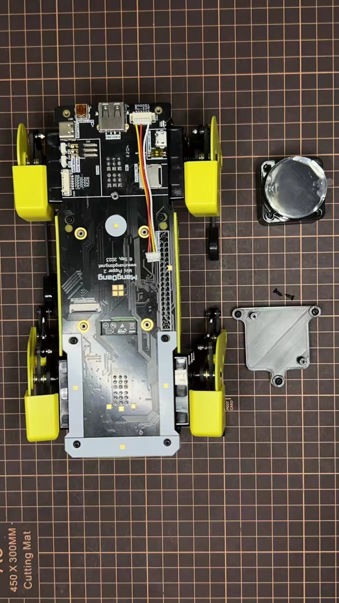

Fix the 3D-printed part on the PCB board.

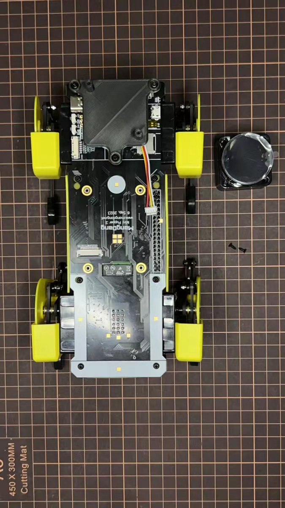

Connect the custom cable to the Lidar module and fix it using the self-tapping screws.

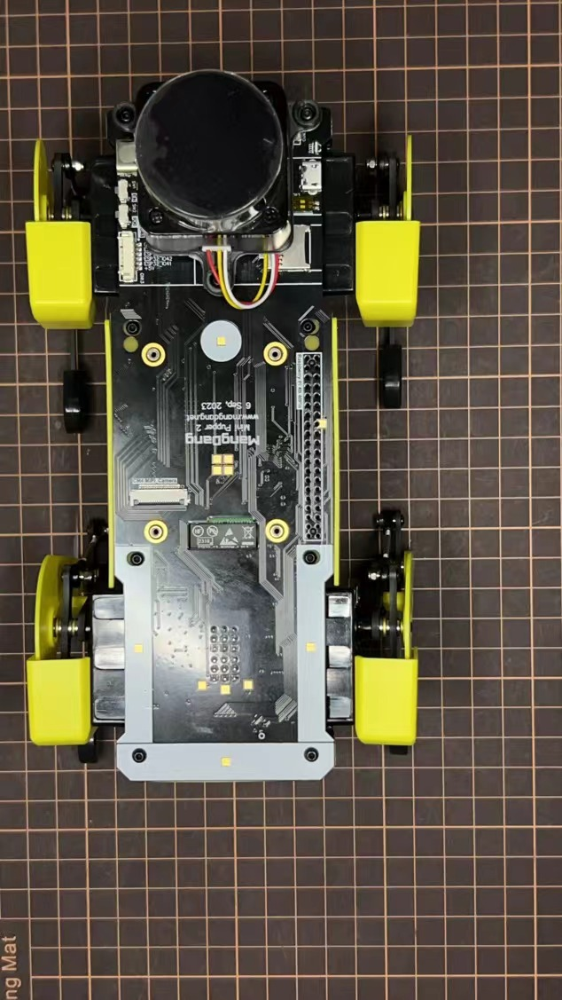

Step 2 Camera
---------------------------------------

Mini Pupper 2 also supports the single Pi camera or OpenCV OAK-D-Lite camera module. You can also print the holder by yourself using the `STL files <https://drive.google.com/drive/folders/1YyU4w-Ry1G25047BGe2m4Fi_TPRtYV0c?usp=sharing>`_

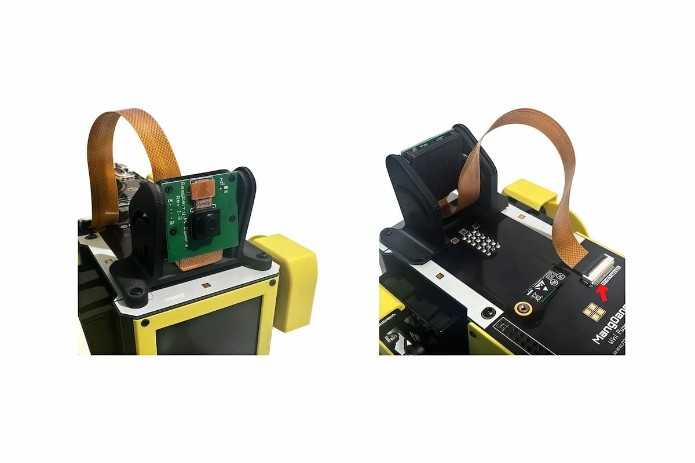

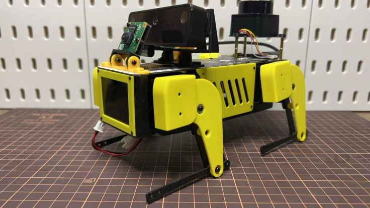

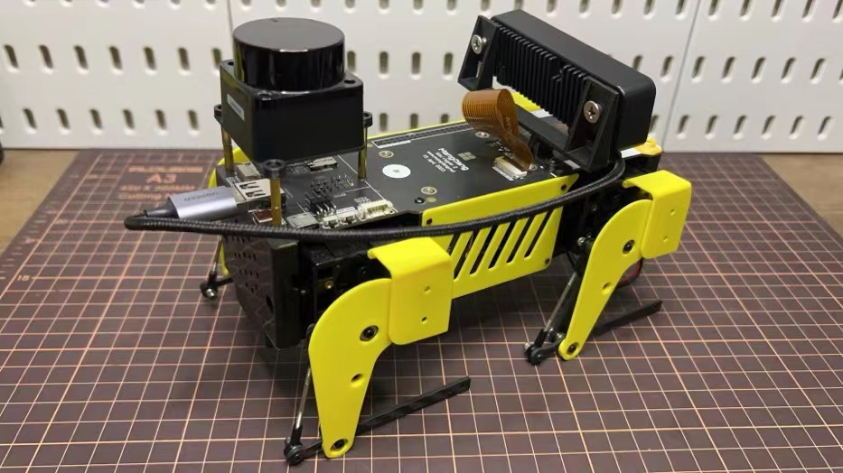

.. raw:: html

   

