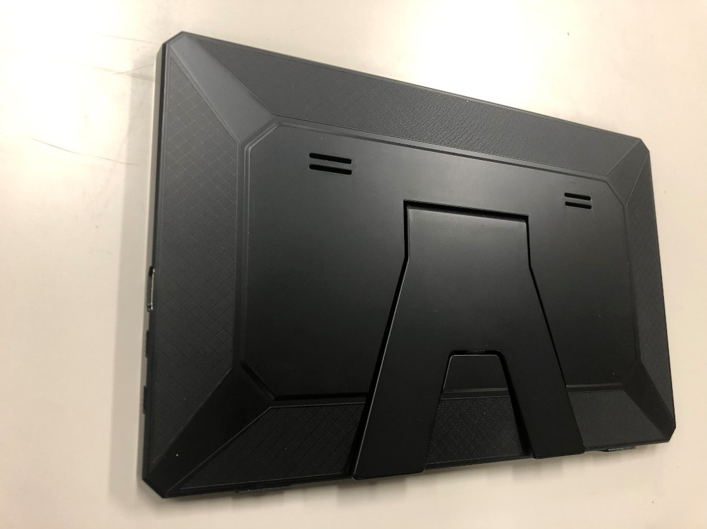
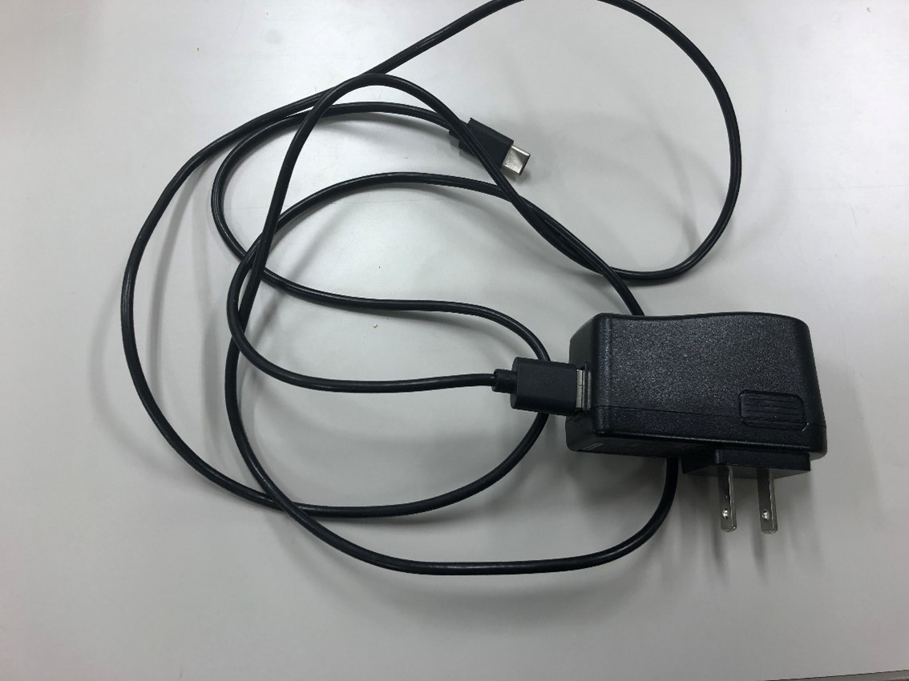
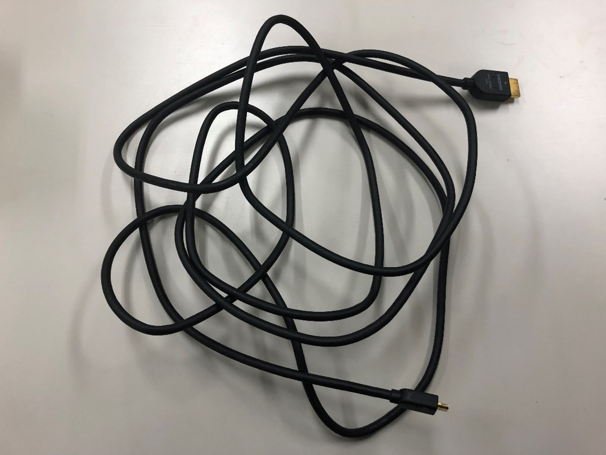
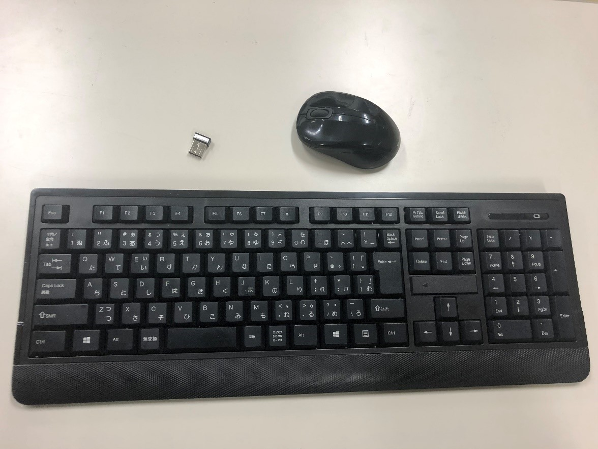
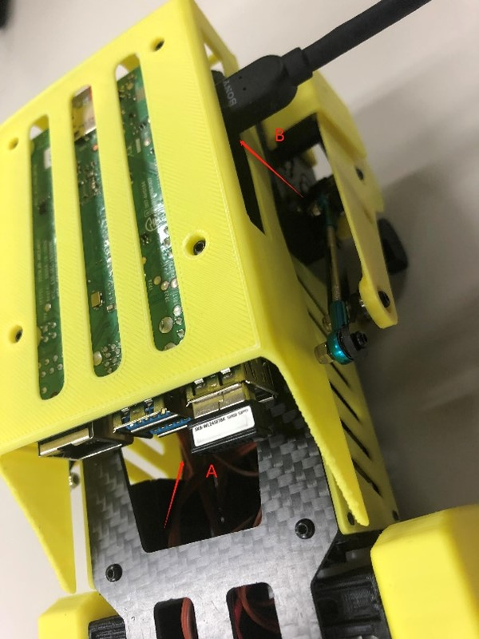
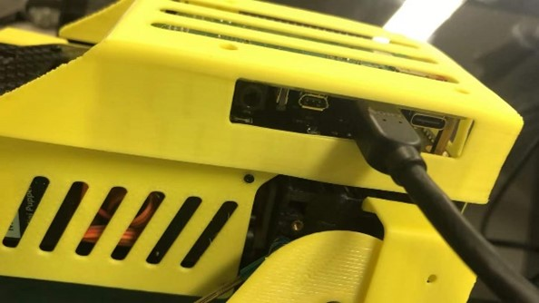
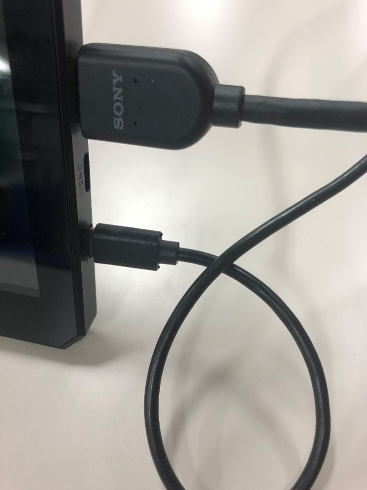
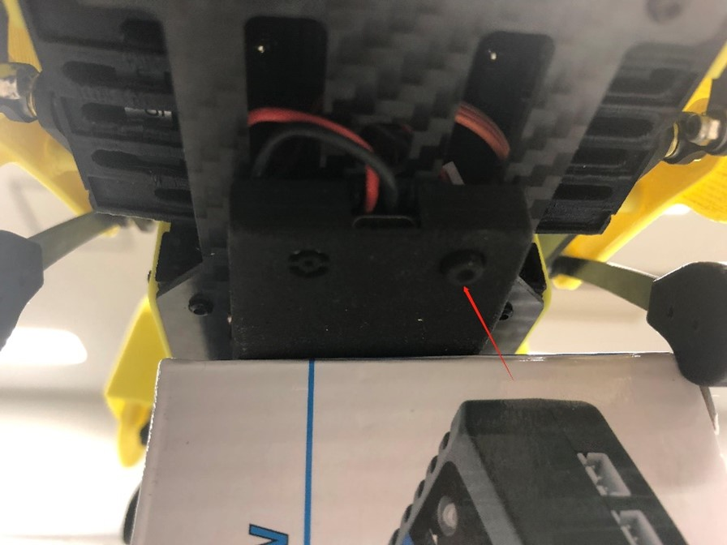

Expansion functions
===================

.. contents::
  :depth: 2

1. Facial Animation
-------------

Prerequisites
^^^^^^^^^^^^^^^^^^^^^

* HDMI ポート付きのディスプレイ

* ディスプレイ用のダプター

* HDMI ケーブル

* マウスとキーボード

* 顔用の写真および写真ファイルが入っている USB メモリ
.. image:: ../_static/165.jpg
  :align: center

実践
^^^^^^^^^^^^^^^^^^^^^

①	MiniPupper を HDMI モニタに接続する

上記の画像の中の A と B について、

* A: 無線マウスとキーボードの USB 受信機
* B: HDMI コードを MiniPupper に入っているラズパイ上の mini HDMI ポートに接続

もちろん、モニタ側にも HDMI 端子を入れます。

②	電源を入れて立ち上げる

本体下にある電源ボタンを３秒長押しします。

③ Ubuntu システムにログイン

.. image:: ../_static/172.jpg
  :align: center

初期パースワードは `mangdang` となります。

ログインした後、Ubuntu 20.04 のデスクトップ GUI に入れます。

2. Gait Performance
-------------

Will update soon!
