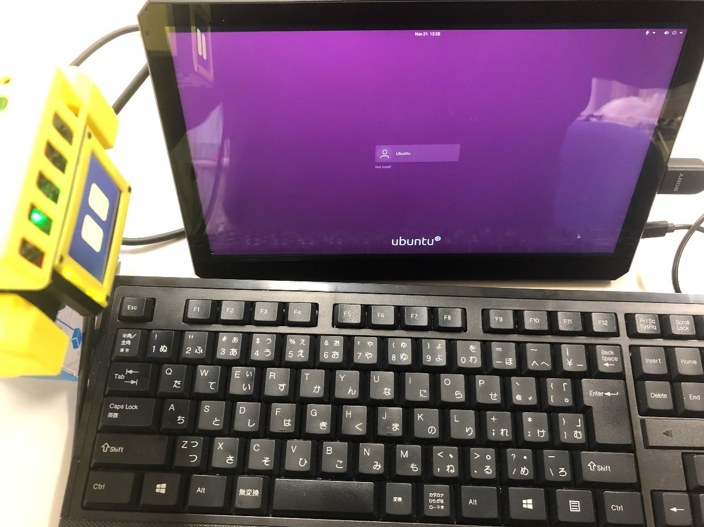
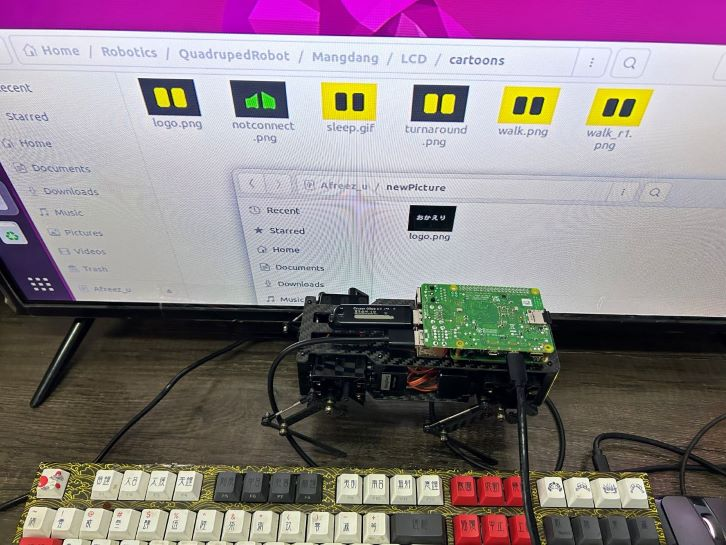
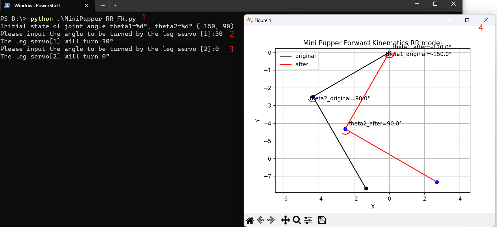

==============================
Examples
==============================

.. contents::
  :depth: 2

1. Custom shell parts
----------------------
Mini Pupper is an open source project, that means, you can custom what you want.
You can find all the `3D printed shell files <https://drive.google.com/drive/folders/12FDFbZzO61Euh8pJI9oCxN-eLVm5zjyi?usp=sharing>`_  and custom them.

How about connect it to LEGO parts?

.. image:: ../_static/LEGO.jpg
  :align: center

Or DIY it like @nisshan_

.. raw:: html

    

        <iframe width="560" height="315" src="https://www.youtube.com/embed/PfGvPq9QuLQ?mute=1" frameborder="0" allow="accelerometer; autoplay; encrypted-media; gyroscope; picture-in-picture" allowfullscreen></iframe>
    

2. Custom Facial Animation
--------------------------

2.1 Prerequisites
^^^^^^^^^^^^^^^^^^^^^^^^^^^^^^^^^^^^^^^^

* HDMI Display
* micro HDMI cable
* Keyboard and mouse
* a new custom picture(size: 320x240 pix)

2.2 Run
^^^^^^^^

* Connect MiniPupper to a display, a keyboard and a mouse.

* Ubuntu login(The default password is mangdang)

* Replace the logo.png file using your custom picture

* Reboot Mini Pupper and then you will see your custom picture

3. Keyboard controller
-----------------------

3.1 Keyboard controller based on nonROS version
^^^^^^^^^^^^^^^^^^^^^^^^^^^^^^^^^^^^^^^^^^^^^^^^^
The feature is based on `PupperKeyboardController project <https://github.com/stanfordroboticsclub/PupperKeyboardController>`_, it's Pygame-based keyboard controller for Stanford Pupper.

* Install PyGame

::

	pip install pygame

* Controls

::

	wasd: left joystick
	arrow keys: right joystick
	q: L1
	e: R1
	ijkl: d-pad
	x: X
	square: u
	triangle: t
	circle: c

3.2 Keyboard controller based on ROS version
^^^^^^^^^^^^^^^^^^^^^^^^^^^^^^^^^^^^^^^^^^^^

Please refer to the SLAM section.

4. Web controller
------------------

Please refer to `Mini Pupper Web controller project <https://github.com/mangdangroboticsclub/mini_pupper_web_controller>`_.

5. How to control a Mini Pupper PWM servo
--------------------------------------------

Mini Pupper servo is a PWM servo, You can connect one servo to Pi board as the following picture shows,
run the samle code,and then the servo will move.
You can find the code `here <https://drive.google.com/drive/folders/1QUYSe1RQOWlZGtCwDqMqtEGB5tKNtcVj?usp=sharing>`_.
You can run it on your Windows or Ubuntu with Python environment, just like the following picture shows.

6. Forward Kinematics
-----------------------

Lecture
^^^^^^^^^

Please study the basic knowledge of forward kinematics online first.

You can also refer to the following video clips come from `Stanford Robotics Independent Study <https://pupper-independent-study.readthedocs.io/en/latest/course-material/lab-3-spr22.html>`_.

Forward kinematics lecture

.. raw:: html

    

        <iframe width="560" height="315" src="https://www.youtube.com/embed/nFqTsAEywpY" frameborder="0" allow="accelerometer; autoplay; encrypted-media; gyroscope; picture-in-picture" allowfullscreen></iframe>
    

Follow-up lecture to clarify some things

.. raw:: html

    

        <iframe width="560" height="315" src="https://www.youtube.com/embed/XAUXrRtINTQ" frameborder="0" allow="accelerometer; autoplay; encrypted-media; gyroscope; picture-in-picture" allowfullscreen></iframe>
    

Sample code
^^^^^^^^^^^^^

We prepared a simple Forward kinematics sample code based on Mini Pupper, you can try it `here <https://drive.google.com/drive/folders/1QUYSe1RQOWlZGtCwDqMqtEGB5tKNtcVj?usp=sharing>`_.
You can run it on your Windows or Ubuntu with Python environment, just like the following picture shows.

7. Inverse Kinematics
-------------------------

Lecture
^^^^^^^^

Please study the basic knowledge of inverse kinematics online first.

You can also refer to the following video clips come from `Stanford Robotics Independent Study <https://pupper-independent-study.readthedocs.io/en/latest/course-material/lab-4-spr22.html>`_.

.. raw:: html

    

        <iframe width="560" height="315" src="https://www.youtube.com/embed/FvQ6NbqDR1U" frameborder="0" allow="accelerometer; autoplay; encrypted-media; gyroscope; picture-in-picture" allowfullscreen></iframe>
    

Sample code
^^^^^^^^^^^^

We prepared a simple Inverse kinematics sample code based on Mini Pupper, you can try it `here <https://drive.google.com/drive/folders/1QUYSe1RQOWlZGtCwDqMqtEGB5tKNtcVj?usp=sharing>`_.
You can run it on your Windows or Ubuntu with Python environment, just like the following picture shows.

8. PID control
---------------

Will update later!

9. Docker
-------------

9.1 Docker for Pupper
^^^^^^^^^^^^^^^^^^^^^^
Dockerfile for Mini Pupper ROS package, comes from `docker-mini-pupper-ros project <https://github.com/Tiryoh/docker-mini-pupper-ros.git>`_.

9.2 Docker for Host
^^^^^^^^^^^^^^^^^^^^^^^^^^^^^^^^^^^^^^^^
Host computer setup for interfacing with a Mini Pupper over a network, comes from `mp_host_setup project <https://github.com/zmk5/mp_host_setup.git>`_.

10. Scratch program
--------------------

Will update soon!
