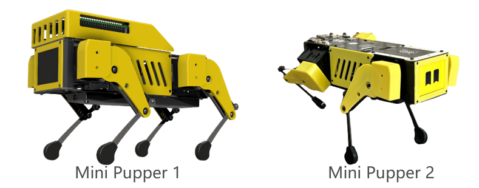
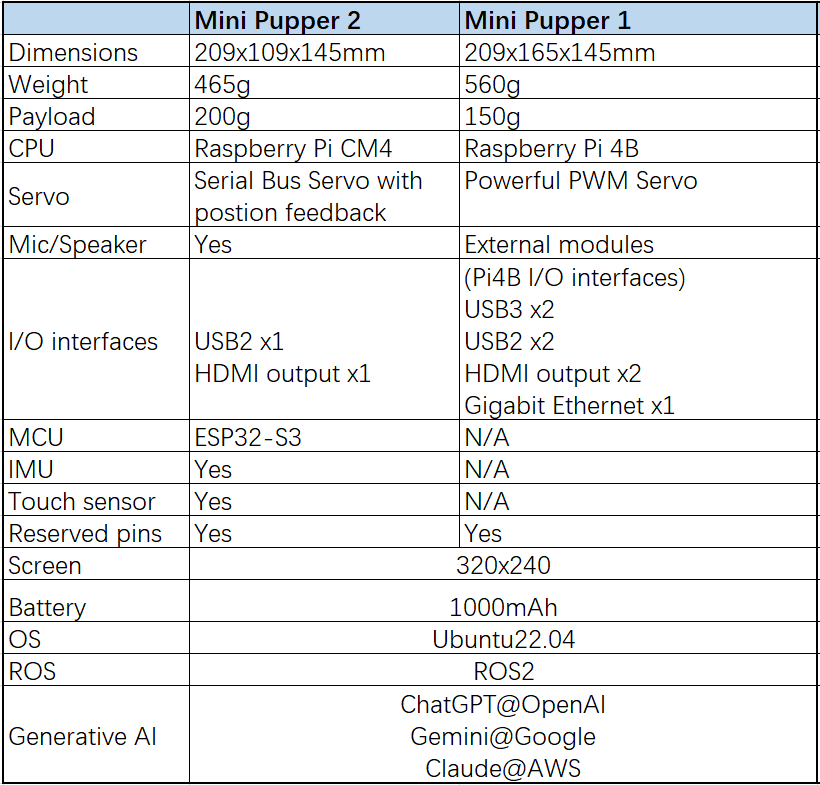
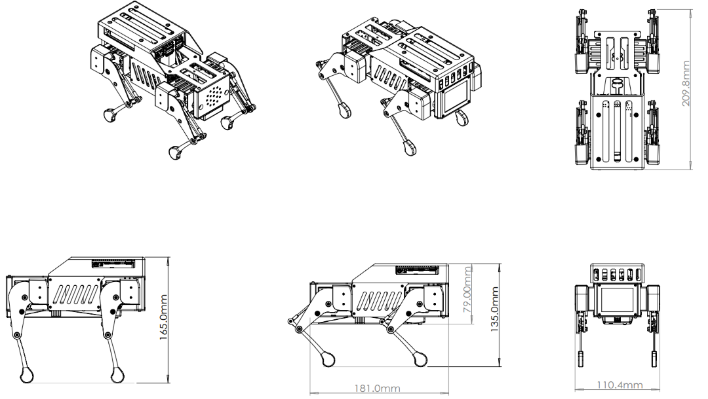
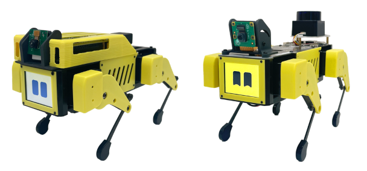
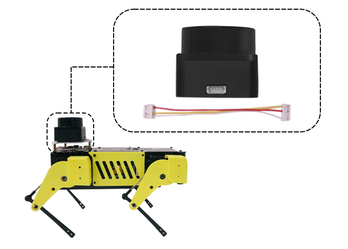

Features
==============================

.. contents::
  :depth: 2

Hardware Specifications
^^^^^^^^^^^^^^^^^^^^^^^^

Mini Pupper 1 Dimension
^^^^^^^^^^^^^^^^^^^^^^^^

Add-ons
^^^^^^^^^^^^^^^^^^^^^^^^^^^^^^^^^^^^^^^^

* Lidar module

If you want to explore ROS SLAM, Navigation functions based on Lidar, you also need a Lidar module. We can ONLY ensure the STL-06P Lidar module can work well based on our source code, and NOT ensure that you get it from other channels. We customized the Lidar cable to connect our robot easily instead of using bulky wires.

* Camera module

If you want to explore OpenCV camera AI functions, you can choose a single MIPI camera, such as Raspberry Pi v2 or v1.3 `camera module. <https://www.raspberrypi.com/documentation/accessories/camera.html>`_
