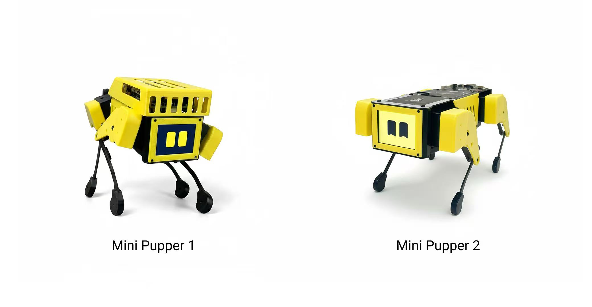
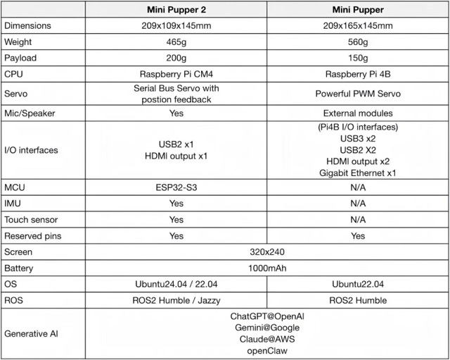
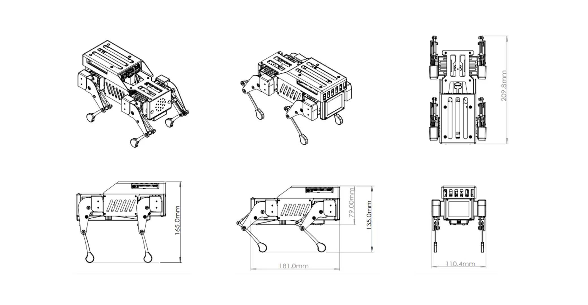
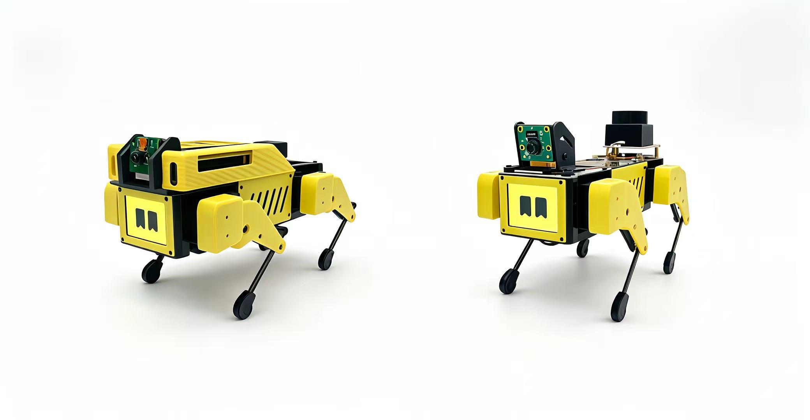
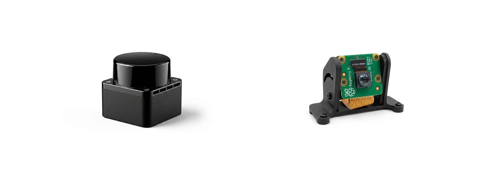

========
Features
========

.. contents::
   :local:
   :depth: 2

Hardware Specifications
=======================

|

Mini Pupper Dimension
=======================

|

Add-ons & Modules
=================

* Lidar Module

If you want to explore ROS SLAM and navigation functions based on Lidar, a Lidar module is required. We can ONLY guarantee that the STL-06P Lidar module works seamlessly with our official source code. We cannot ensure compatibility if purchased from other channels. We have customized the Lidar cable for easy connection, eliminating bulky wiring.

* Camera Module

To explore OpenCV and vision-based AI functions, you can choose a single MIPI camera, such as the Raspberry Pi `Camera Module v1.3 or v2 <https://www.raspberrypi.com/documentation/accessories/camera.html>`_.

