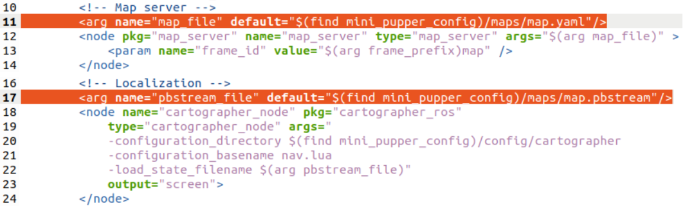

==============================
Navigation
==============================

.. contents::
  :depth: 2

Summary
-----------------

.. raw:: html

    

        <iframe width="560" height="315" src="https://www.youtube.com/embed/jb2yxs2YUsI?mute=1" frameborder="0" allow="accelerometer; autoplay; encrypted-media; gyroscope; picture-in-picture" allowfullscreen></iframe>
    

Mini Pupper's ROS version is based on `Champ <https://github.com/chvmp/champ>`_  open source project, and we made some changes to Navigation functions.

1. ROS1(Noetic) Navigation based on Lidar
------------
Before run the below steps, please confirm you already prepared all the environment in SLAM section.

1.1 Change the map file
^^^^^^
Before running navigation, you should first change the launch file with the map you created. 
::

	roscd mini_pupper/launch
	sudo gedit navigate.launch

Then change arg of the map_file and pbstream_file.

1.2 Run the base driver
^^^^^^
**You should run this command on Mini Pupper**
::

	roslaunch mini_pupper bringup.launch

1.3 Run Cartographer(for localization) and Move_Base
^^^^^^
**You should run this command on PC**
**If you are using gazebo, set the param /use_sim_time to true in the launch file.**
::

	roslaunch mini_pupper navigate.launch