==================
Quick Start Guide
==================

.. contents::
  :depth: 2

Run Pupper Robot using controller
-----------------

You can use the controller to play Stanford Pupper, Mini Pupper and Mini Pupper 2, the steps are same.

.. |youtu.be-pre-assembled-user-guide| raw:: html

  <iframe width="560" height="315" src="https://www.youtube.com/embed/FRBh3URTuuI?mute=1" title="YouTube video player" frameborder="0" allow="accelerometer; autoplay; clipboard-write; encrypted-media; gyroscope; picture-in-picture" allowfullscreen></iframe>

.. |youtu.be-pre-assembled-user-guide-ja| raw:: html

  <iframe width="560" height="315" src="https://www.youtube.com/embed/kZtt_XulZ7E?mute=1" title="YouTube video player" frameborder="0" allow="accelerometer; autoplay; clipboard-write; encrypted-media; gyroscope; picture-in-picture" allowfullscreen></iframe>

|youtu.be-pre-assembled-user-guide|

1. Power On Mini Pupper

    * Push on the battery power button for at least 3 seconds to power on Mini Pupper. After power on, if you push on the power button for at least 3 seconds again, it will power off.

2. Connect the controller to the Pi by putting it pairing mode.

    * To put it into pairing mode, hold the share button and home button at the same time until it starts making quick double flashes.
    * If it starts making slow single flashes, hold the home button down until it stops blinking(about 15s) and try again.

.. image:: ../_static/131.jpg
    :align: center

3. Wait until the controller binds to the robot, at which point the controller should turn a dim green (or whatever color you chose in pupper/HardwareConfig.py for the deactivated color).
4. Press L1 on the controller to "activate" the robot. The controller should turn bright green (or again, whatever you chose in HardwareConfig).
5. You're good to go! Check out the controls section below for operating instructions.

Pupper Robot controls using controller
-----------------------

* L1: Press to toggle active mode and deactivate mode.

    * Note: the controller's front light will change colors to indicate if the robot is deactivated or activated.

* R1: Press to transition between Rest mode and Trot mode.

* Left joystick

    * Forward/back: moves the robot forward/backward when in Trot mode.
    * Left/right: moves the robot left/right when in Trot mode.

* Right joystick

    * Forward/back: pitches the robot forward/backward.
    * Left/right: turns the robot left/right.

* D-Pad
    * Forward/back: raises and lowers the body.
    * Left/rights: rolls the body left/right.

* "X" button: Press it three times to complete a full hop.

* Shut down the system to press controller circle botton for 3 seconds.

.. image:: ../_static/132.jpg
    :align: center

* Power off the battery

Important Notes using controller
---------------

* Controller pairing instructions (repeat of instructions above)

    * To put it into pairing mode, hold the share button and home button at the same time until it starts making quick double flashes.
    * If it starts making slow single flashes, hold the home button down until it stops blinking and try again.

* Battery voltage

    * If you use external power supply to power the robot with anything higher than 8.4V (aka >2S) you'll almost certainly fry all your servos!

Run Mini Pupper 2 Generative AI functions
######################

Preparation
------------

Charging the battery
^^^^^^^^^^^^
* The battery is charged via USB, see picture for USB socket, and can also be charged while attached to the Mini Pupper body.

※ LED light: Green means there is enough power, and Red means you need to charge it.

※ We recommend 5V/1A adapter, if you use 5V/2A adapter, the battery IC will change it to 1A. It needs about 1 hour to charge 80% and the light will become green, and an additional 1 hour to 100%, anyway, you can use it when the light becomes green.

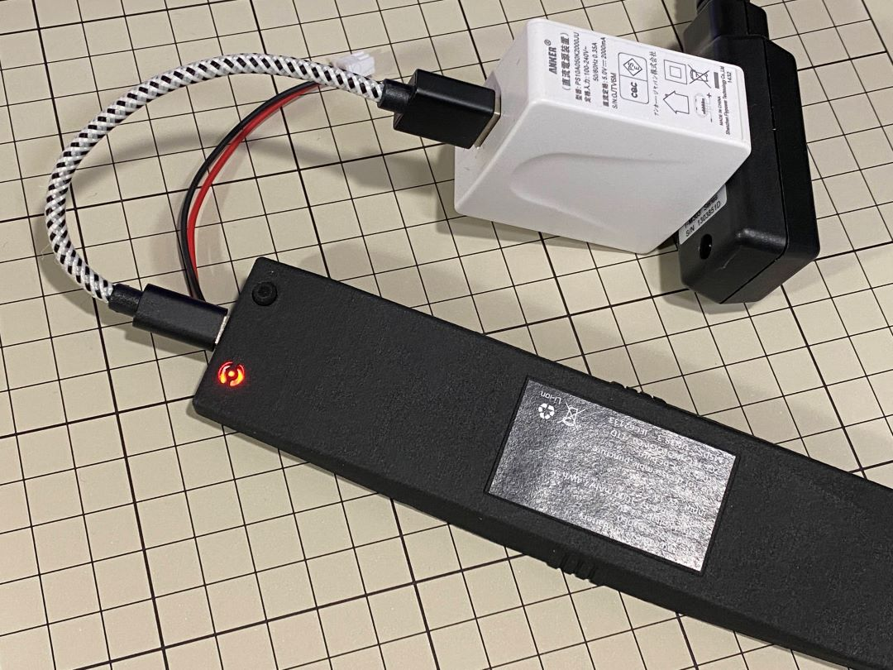

Power On
^^^^^^^^^^^^
The battery runs continuously for about 30 minutes, and if you want it to work for a long time, you can connect the adapter.

Connect the battery by hand.

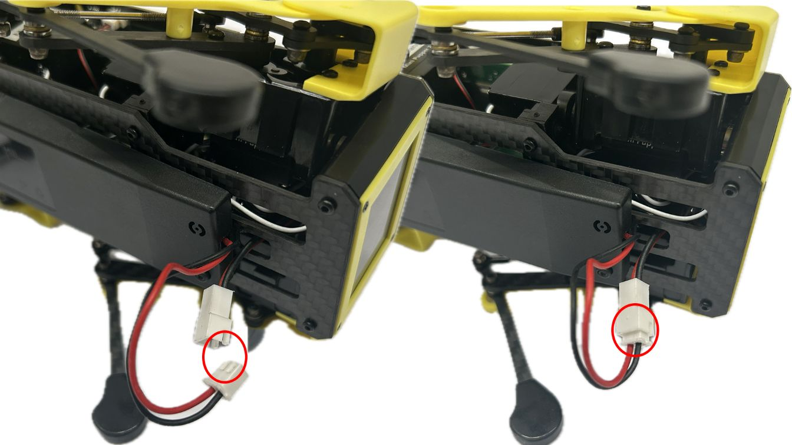

If you press and hold the battery button manually for more than 3 seconds, the battery will turn green and light up.

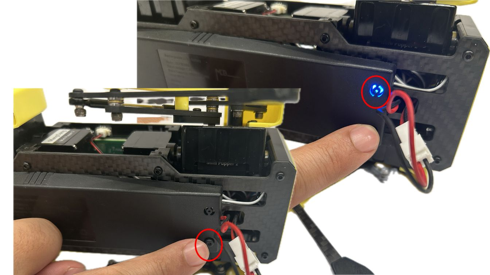

When the power adapter is connected to the robot, it starts automatically.

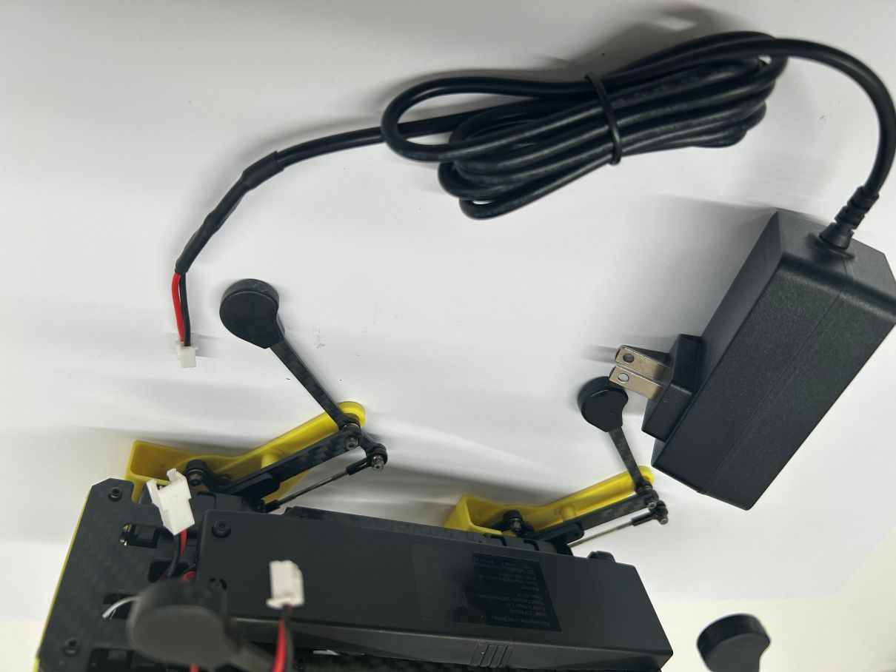

Quick start using the default WiFi
------------

Connect the robot to the default WiFi
^^^^^^^^^^^^

The robot will find the default WiFi by itself after starting up.

You can set the default WiFi on your phone before booting.
* WiFi name: Mangdang
* WiFi password: mangdang 

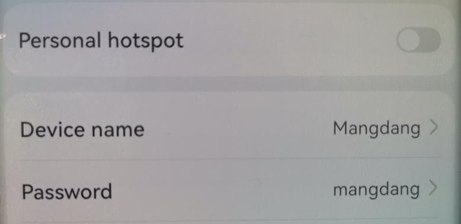

Please refer to the following video demo.
https://youtube.com/shorts/djDqob18IsQ

Try AI functions
^^^^^^^^^^^^
When you turn on Mini Pupper, the display will connect to the default WiFi after about 30 seconds, the IP address will be displayed.

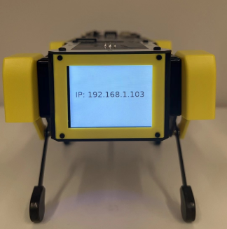

To connect to the robot, please use your mobile phone or PC browser (please connect to the default WiFi and make sure you are on the same network as the robot).
After confirming the IP address of the robot, connect the robot using the browser. For example, if the IP address is "192.168.1.103," enter "192.168.1.103:8080" in the browser.

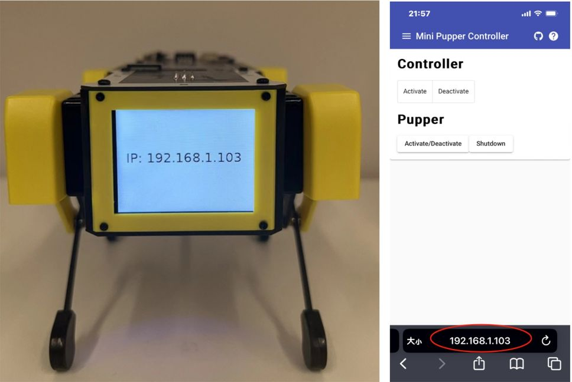

Enable AI mode
^^^^^^^^^^^^

Capture from the phone

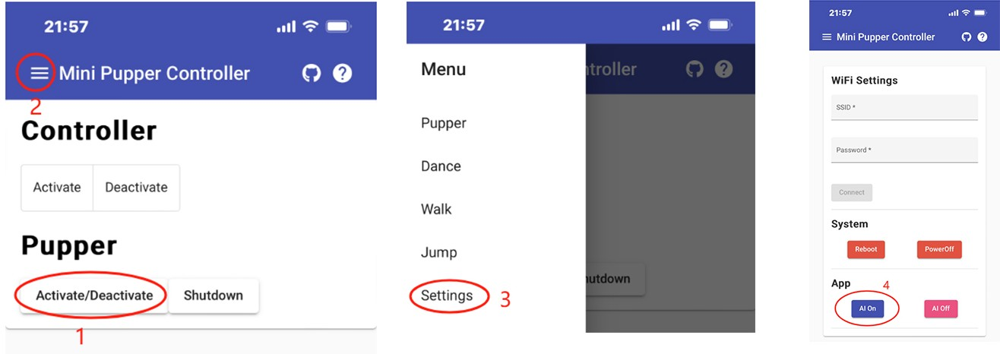

“Activate/Deactivate” -->  “三”  --> “Settings” --> “AI On” .

Capture from the PC

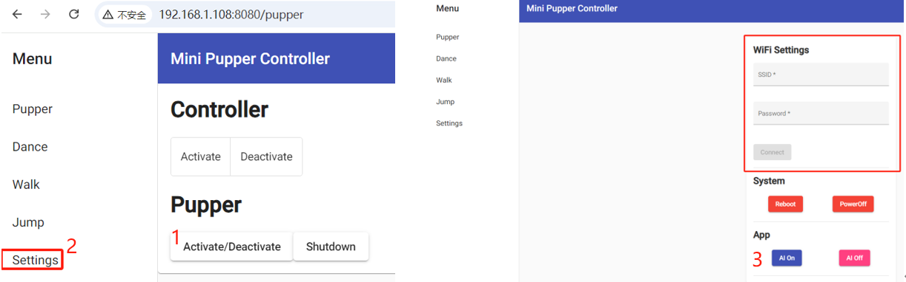

“Activate/Deactivate” -->  “Settings” -->  “AI On” .

After clicking "AI On," wait for about 15 seconds until the display blinks once or twice and displays "Hello, World."

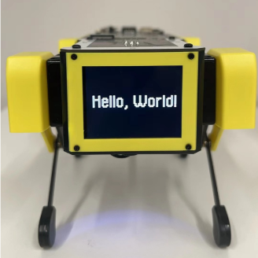

Run the AI functions
^^^^^^^^^^^^

You can talk to the robot and control it with the keywords

* dance ( The robot will dance when he hear the key word “dance”.)
* game（The robot will play rock-paper-scissors game with you when he hear the key word “game”.）
* picture(The robot will take a photo and analyze it when he hear the key word “picture”.)
* The robot will do relative actions when he hear the key word “look up” or “look down” or “look left” or “look right” or “come”.

Disable the AI functions
^^^^^^^^^^^^

AI mode disable: click「AI off」button.

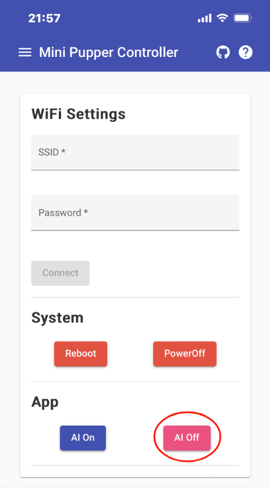

Tip: The AI function can work continuously for about 20 minutes. If you want to use it for a long time, you can manually turn it off and restart it every 15 minutes. We will check how to make it work for a long time in the future.

Connect your own WiFi
------------

If you want to set up your Mini Pupper to connect to WiFi in your home or office, follow the steps below.

Step 1: First, follow the steps above to connect the Mini Pupper to the default WiFi.

Step 2: After checking the IP address of the robot, connect to the robot using your mobile phone or PC (also connect to the default WiFi) browser. For example, if the IP address is "192.168.1.108," enter "192.168.1.108:8080" in the browser.

	
Step 3: Click "Setting" on the bottom left, and you will see the settings page on the right. After that, enter your home / office WiFi SSID and password, click "Connect," and then click "Reboot."

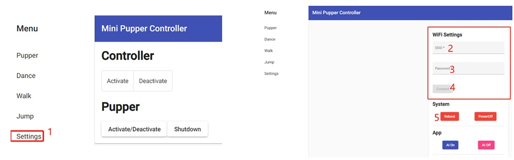

Tip: Make sure WiFi is active before restarting the robot.