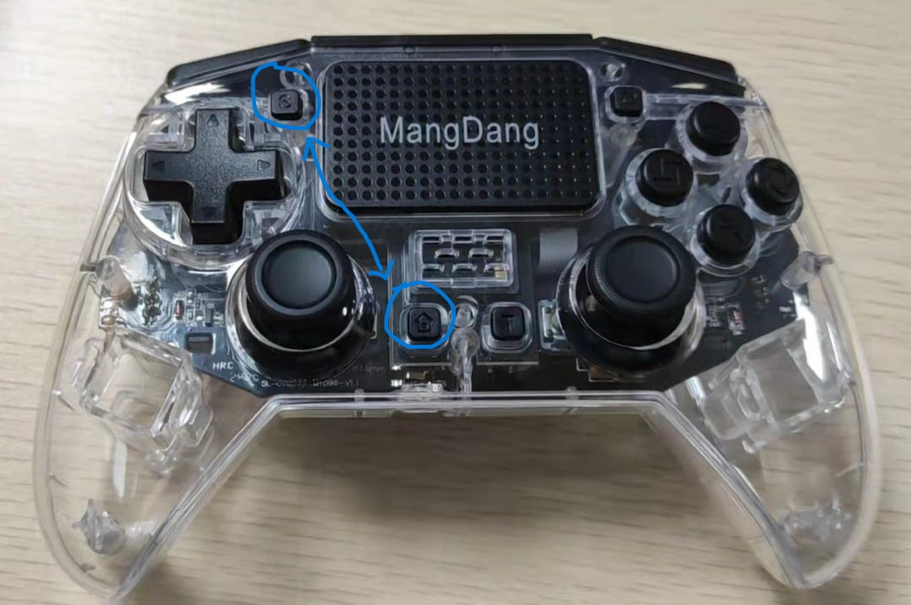
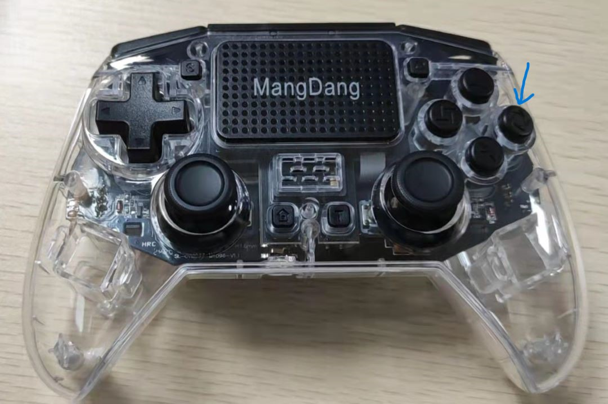

==================
Quick Start Guide
==================

.. contents::
  :depth: 2

Run Pupper Robot
-----------------

.. |youtu.be-pre-assembled-user-guide| raw:: html

  <iframe width="560" height="315" src="https://www.youtube.com/embed/FRBh3URTuuI?mute=1" title="YouTube video player" frameborder="0" allow="accelerometer; autoplay; clipboard-write; encrypted-media; gyroscope; picture-in-picture" allowfullscreen></iframe>

.. |youtu.be-pre-assembled-user-guide-ja| raw:: html

  <iframe width="560" height="315" src="https://www.youtube.com/embed/kZtt_XulZ7E?mute=1" title="YouTube video player" frameborder="0" allow="accelerometer; autoplay; clipboard-write; encrypted-media; gyroscope; picture-in-picture" allowfullscreen></iframe>

|youtu.be-pre-assembled-user-guide|

1. Power On Mini Pupper

    * Push on the battery power button for at least 3 seconds to power on Mini Pupper. After power on, if you push on the power button for at least 3 seconds again, it will power off.

2. Connect the controller to the Pi by putting it pairing mode.

    * To put it into pairing mode, hold the share button and home button at the same time until it starts making quick double flashes.
    * If it starts making slow single flashes, hold the home button down until it stops blinking(about 15s) and try again.

3. Wait until the controller binds to the robot, at which point the controller should turn a dim green (or whatever color you chose in pupper/HardwareConfig.py for the deactivated color).
4. Press L1 on the controller to "activate" the robot. The controller should turn bright green (or again, whatever you chose in HardwareConfig).
5. You're good to go! Check out the controls section below for operating instructions.

Pupper Robot controls
-----------------------

* L1: Press to toggle active mode and deactivate mode.

    * Note: the controller's front light will change colors to indicate if the robot is deactivated or activated.

* R1: Press to transition between Rest mode and Trot mode.

* Left joystick

    * Forward/back: moves the robot forward/backward when in Trot mode.
    * Left/right: moves the robot left/right when in Trot mode.

* Right joystick

    * Forward/back: pitches the robot forward/backward.
    * Left/right: turns the robot left/right.

* D-Pad
    * Forward/back: raises and lowers the body.
    * Left/rights: rolls the body left/right.

* "X" button: Press it three times to complete a full hop.

* Shut down the system to press controller circle botton for 3 seconds.

* Power off the battery

Important Notes
---------------

* Controller pairing instructions (repeat of instructions above)

    * To put it into pairing mode, hold the share button and home button at the same time until it starts making quick double flashes.
    * If it starts making slow single flashes, hold the home button down until it stops blinking and try again.

* Battery voltage

    * If you use external power supply to power the robot with anything higher than 8.4V (aka >2S) you'll almost certainly fry all your servos!
