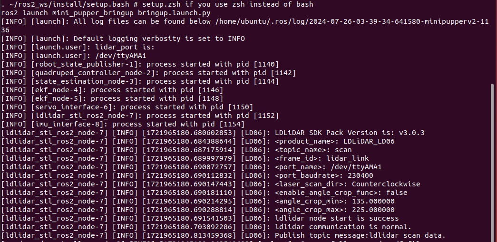

=================
ROS2 Guide
=================

.. contents::
  :depth: 2

Installation
######################

* Mini Pupper's ROS2 installation package is based on `ros2_setup_scripts <https://github.com/Tiryoh/ros2_setup_scripts_ubuntu>`_  which is written by one of our contributor @Tiryoh.
* Mini Pupper's ROS2 version is based on `Champ <https://github.com/chvmp/champ>`_  open source project, and we made some changes to SLAM and Navigation functions.
* Mini Pupper's software supporting lidar sensor is based on `ldlidar_stl_ros2 <https://github.com/ldrobotSensorTeam/ldlidar_stl_ros2>`_  open source project.

We recommend you explore Mini Pupper with ROS2 network, make sure your PC and Mini Pupper have connected to the same WiFi.

Through the following steps, you will be able to setup the ros2 for your remote PC and the Mini Pupper.

1. PC Setup
------------------------

PC Setup corresponds to PC (your desktop or laptop PC) for controlling Mini Pupper remotely. Do not apply these commands to your Mini Pupper.

**WARNING: The contents in this chapter corresponds to the Remote PC (your desktop or laptop PC) which will control Mini Pupper. Do not apply these commands to your Raspberry Pi on Mini Pupper or Compute Module 4 on Mini Pupper 2.**

**NOTE: This instruction was tested on Linux with Ubuntu 22.04 and ROS2 Humble.**

1.1 Install ROS 2 Humble
^^^^^^^^^^^^^^^^^^^^^^^^^^^

Open the terminal with Ctrl+Alt+T from Remote PC.

::

	cd ~
	sudo apt update
	git clone https://github.com/Tiryoh/ros2_setup_scripts_ubuntu.git
	~/ros2_setup_scripts_ubuntu/ros2-humble-ros-base-main.sh
	source /opt/ros/humble/setup.bash

After ROS 2 installation, download the Mini Pupper ROS package in the workspace.

1.2 Install Mini Pupper ROS Repository
^^^^^^^^^^^^^^^^^^^^^^^^^^^^^^^^^^^^^^^^

Open the terminal with Ctrl+Alt+T from Remote PC.

::

	mkdir -p ~/ros2_ws/src
	cd ~/ros2_ws/src
	git clone https://github.com/mangdangroboticsclub/mini_pupper_ros.git -b ros2-dev mini_pupper_ros
	vcs import < mini_pupper_ros/.minipupper.repos --recursive

1.3 Install Dependent ROS 2 Packages and Build Package
^^^^^^^^^^^^^^^^^^^^^^^^^^^^^^^^^^^^^^^^^^^^^^^^^^^^^^^^^^^

Open the terminal with Ctrl+Alt+T from Remote PC.

::

	cd ~/ros2_ws
	rosdep install --from-paths src --ignore-src -r -y
	sudo apt install ros-humble-teleop-twist-keyboard
	sudo apt install ros-humble-teleop-twist-joy
	colcon build --symlink-install

1.4. Export Robot Model
^^^^^^^^^^^^^^^^^^^^^^^^^^

1. Open ~/.bashrc with text editor in the terminal.

::

	nano ~/.bashrc

2. Scroll to the end of the file.

|

3. Add the following line to export the robot model with the computer. Please use the proper keyword among mini_pupper, mini_pupper_2 for the ROBOT_MODEL parameter according to your robot model.

::

 	export ROBOT_MODEL=mini_pupper_2

4. Save the file with Ctrl+S and exit with Ctrl+X.
5. Run the following command to apply the change.

::

	source ~/.bashrc

2. Mini Pupper Setup
------------------------

2.1 Image flashing
^^^^^^^^^^^^^^^^^^^^

The steps below are for you to setup ROS2 environment of Mini Pupper by yourself.
You can also download the `pre-built ROS image <https://drive.google.com/drive/folders/1ZF4vulHbXvVF4RPWWGxEe7rxcJ9LyeEu?usp=sharing>`_ for Mini Pupper side, named "YYYYMMDD_MD-Puppy2_ROS2Humble_Ubuntu22.04.img" or "YYYYMMDD_MD-Puppy1_ROS2Humble_Ubuntu22.04.img". Please select the appropriate image according to the date and the robot model.

1. The image can be flashed into the card using an adaptor. If your PC do not have a microSD slot, please use a microSD card reader to burn the image.
2. Download ubuntu-22.04.2-preinstalled-server-arm64+raspi.img.xz from the official website, and flash it into your SD card according to the following guide.
3. Download balenaEtcher from https://etcher.balena.io/.
4. Press the blue button to choose the destination where you download the image and select the image.

.. image:: ../_static/choose-image.png
    :align: center

|

5. Press the blue button to choose the destination where you are flashing the image into (the address of the SD card).

.. image:: ../_static/target1.png
    :align: center

|

.. image:: ../_static/target2.png
    :align: center

|

6. Press the flash button and you will see the image below. Wait until the process to complete.

.. image:: ../_static/flashing.png
    :align: center

|

.. image:: ../_static/validating.png
    :align: center

|

2.2 WiFi-Setting
^^^^^^^^^^^^^^^^^^^

1. Plug the card into the Mini Pupper card port and setup your own WiFi.

.. image:: ../_static/Sd-card-reader.jpg
    :align: center

|

2. Run the following command to edit the network setting of the pupper.

::

	sudo nano /etc/netplan/50-cloud-init.yaml

When the editor is opened, edit the content as below while replacing Mangdang and mangdang with your actual wifi SSID and password.

.. image:: ../_static/netplan-yaml.png
    :align: center

|

3.	Save the file with Ctrl+S and exit with Ctrl+X.
4.	Run the following commands to reboot and connect to your actual wifi.

::

	sudo netplan apply
	sudo apt update
	sudo apt upgrade
	reboot

2.3 Robot model setting
^^^^^^^^^^^^^^^^^^^^^^^^^

1. After reboot, open ~/.bashrc with text editor in the terminal.

::

	nano ~/.bashrc

2. Scroll to the end of the file.

|

3. Add the following line to export the robot model with the computer. Please use the proper keyword among mini_pupper, mini_pupper_2 for the ROBOT_MODEL parameter according to your robot model.

::

	export ROBOT_MODEL=mini_pupper_2

4. Save the file with Ctrl+S and exit with Ctrl+X.
5. Run the following command to apply the change.

::

	source ~/.bashrc

3. Connecting Mini Pupper to PC
--------------------------------

1. Open two terminals with Ctrl+Alt+T twice, one for connecting to Mini Pupper and one for PC local.
2. Look at monitor of Mini Pupper to obtain the IP address of it.

.. image:: ../_static/IPaddress.jpg
    :align: center

|

3. Use one of the terminals and run the following command to connect to the Mini Pupper. The default password is “mangdang”.

::

	ssh ubuntu@{IP_ADDRESS_OF_MINI_PUPPER}

4. Open ~/.bashrc with text editor in both terminals.

::

	nano ~/.bashrc

5. Scroll to the end of the file for both terminals.

|

6. Add the following line in both terminals to setup the connection. The number inputted can be any number, but it should be the same for both terminals.

::

	 export ROS_DOMAIN_ID=42

7. Save the file with Ctrl+S and exit with Ctrl+X.
8. Run the following command to apply the change.

::

	source ~/.bashrc

9. Use the following command in both terminals to confirm that the PC and the Mini Pupper are connected:

::

	ros2 node list

10. Compare the output in both terminals:

|

If the output in both terminals shows the same list of node which is similar to the picture, your PC and the Mini Pupper is connected

**NOTE: the node list depends on the nodes in progress, which may not be exactly the same from the image.**

.. raw:: html

   

Quick Start
######################

1. Joystick Setup
-----------------------

Through the following steps, you will be able to connect and set up the ROS2 software for the joystick.

1. Press the HOME button on the controller.

.. image:: ../_static/Bluetooth-connection-button.jpg
    :align: center

|

2. Search for available bluetooth devices on your PC and connect to it.

.. image:: ../_static/controller-connection.png
    :align: center

|

.. image:: ../_static/controller-address.png
    :align: center

|

The video below shows the change of flashlight colour during connection.

.. raw:: html

    

        <iframe width="560" height="315" src="https://www.youtube.com/embed/GzUFk6fD8s0" frameborder="0" allow="accelerometer; autoplay; encrypted-media; gyroscope; picture-in-picture" allowfullscreen></iframe>
    

|

3. Use the following command to check the name of the joystick.

Terminal output: In this case the name of the joystick is “js0”.

.. image:: ../_static/dev-input.png
    :align: center

|

4. Use the following command to check if the joystick us connected.

::

	sudo apt install joystick
	jstest /dev/input/{NAME_OF_JOYSTICK}

There will be output as followed if joystick is connected.

.. image:: ../_static/jstest.png
    :align: center

|

2. Bringup
------------------------

Through the following steps, you will be able launch the software to bringup the Mini Pupper hardware.

1. Open a terminal with Ctrl+Alt+T  to connect Mini Pupper.
2. Look at monitor of Mini Pupper to obtain the IP address of it.
3. Use one of the terminals and run the following command to connect to the Mini Pupper. The default password is mangdang.

::

	ssh ubuntu@{IP_ADDRESS_OF_MINI_PUPPER}

4. Bring up basic packages to start Mini Pupper applications. The command of sourcing the built package, ". ~/ros2_ws/install/setup.bash" can be replaced by ". ~/ros2_ws/install/setup.zsh", depending on the file type you use.

::

	. ~/ros2_ws/install/setup.bash
	ros2 launch mini_pupper_bringup bringup.launch.py

When the robot model is Mini Pupper 2, the terminal output will look like below.

|

.. image:: ../_static/Bringup2.png
    :align: center

|

5. Topics and services can be listed with commands below.

* Topic list

::

	ros2 topic list

|

* Service list

::

	ros2 service list

|

3. Teleoporation
------------------

Through the following steps, you will be able to teleoperate Mini Pupper either using the keyboard or joystick.

**WARNING: Make sure to run the Bringup from the Mini Pupper before teleoperation. Teleoperate the robot, and be careful when testing the robot on the table as the robot might fall.**

3.1 Keyboard
^^^^^^^^^^^^^

1. Open a terminal with Ctrl+Alt+T on remote PC.
2. Run teleoperation node using the following command.

::

	. ~/ros2_ws/install/setup.bash
	ros2 run teleop_twist_keyboard teleop_twist_keyboard

Terminal output:

.. image:: ../_static/keyboard-teleop.png
    :align: center

|

You can drive the pupper using the keyboard following the guide below.

.. image:: ../_static/Keyboard-guide.jpg
    :align: center

|

The video shows the effect of each keyboard button on the movement of the robot.

.. raw:: html

    

        <iframe width="560" height="315" src="https://www.youtube.com/embed/M9aV55VnKUw" frameborder="0" allow="accelerometer; autoplay; encrypted-media; gyroscope; picture-in-picture" allowfullscreen></iframe>
    

|

3.2 Joystick
^^^^^^^^^^^^^

**NOTE: The design of button of joystick node on ROS2 is different from that mentioned in other sections which is used for non-ROS programs.**

**WARNING: Make sure to run the Bringup from the Mini Pupper before teleoperation. Teleoperate the robot, and be careful when testing the robot on the table as the robot might fall.**

1. Open a terminal with Ctrl+Alt+T on remote PC.
2. Run teleoperation node using the following command.

::

	. ~/ros2_ws/install/setup.bash
	ros2 launch teleop_twist_joy teleop-launch.py joy_dev:=/dev/input/{NAME_OF_JOYSTICK}

Terminal output:

|

You can drive the pupper using the joystick following the guide below.

.. image:: ../_static/Controller-guide.jpg
    :align: center

|

The video shows the effect of each button of the joystick on the movement of the robot.

.. raw:: html

    

        <iframe width="560" height="315" src="https://www.youtube.com/embed/T8kwO7fDiqE" frameborder="0" allow="accelerometer; autoplay; encrypted-media; gyroscope; picture-in-picture" allowfullscreen></iframe>
    

|

.. raw:: html

   

SLAM
######################

The SLAM (Simultaneous Localization and Mapping) is a technique to draw a map by estimating current location in an arbitrary space. Following the steps below, we can use Mini Pupper to draw a map of the surrounding area.

**NOTE: Please run the SLAM node on Remote PC.**
**Make sure to launch the Bringup from Mini Pupper before executing any operation.**

1. Run SLAM Node
----------------

1. If Bringup is not launched on Mini Pupper, launch Bringup first.

•	Open a terminal with Ctrl+Alt+T  to connect Mini Pupper.
•	Look at monitor of Mini Pupper to obtain the IP address of it.

•	Use one of the terminals and run the following command to connect to the Mini Pupper. The default password is mangdang.

::

	ssh ubuntu@{IP_ADDRESS_OF_MINI_PUPPER}

•	Bring up basic packages to start Mini Pupper applications.

::

	. ~/ros2_ws/install/setup.bash
	ros2 launch mini_pupper_bringup bringup.launch.py

2. Open a new terminal from Remote PC with Ctrl + Alt + T and launch the SLAM node.

::

	. ~/ros2_ws/install/setup.bash
	ros2 launch mini_pupper_slam slam.launch.py

2. Teleoperation
-----------------

Following the steps below, we can use teleoperation to explore unknown area of the map.

**NOTE: Once SLAM node is successfully up and running. Vigorous change of the linear and angular speed might lower the smoothness of map generated.**
**WARNING: Make sure to run the Bringup from the Mini Pupper before teleoperation. Be careful when testing the robot on the table as the robot might fall during teleoperation.**

2.1 Keyboard
^^^^^^^^^^^^^^

1. Open a terminal with Ctrl+Alt+T on remote PC.
2. Run teleoperation node using the following command.

::

	. ~/ros2_ws/install/setup.bash
	ros2 run teleop_twist_keyboard teleop_twist_keyboard

2.2 Joystick
^^^^^^^^^^^^^^

1. Open a terminal with Ctrl+Alt+T on remote PC.
2. Run teleoperation node using the following command.

::

	. ~/ros2_ws/install/setup.bash
	ros2 launch teleop_twist_joy teleop-launch.py joy_dev:=/dev/input/{NAME_OF_JOYSTICK}

After teleoperation, a map with unknown area revealed will be shown as followed:

|

3. Save the map
----------------

Following the steps below, the files of the map will be saved.

1. Open a terminal with Ctrl+Alt+T on remote PC.
2. Use the following command to launch the map_saver_cli node in the nav2_map_server package to create map files.

The map file is saved in the directory where the map_saver_cli node is launched at.

::

	. ~/ros2_ws/install/setup.bash
	ros2 run nav2_map_server map_saver_cli -f ~/map

After running the above command, two files will be generated, namely map.pgm and map.yaml.

The following pictures shows the .pgm file to be saved.

|

.. raw:: html

   

Navigation
######################

Navigation allows the robot to move from one location to the specified destination based on the infomation of a map given from the IMU and the lidar sensor created from SLAM.

The following video shows how we can use the navigation function to make the Mini Pupper move along the planned path.

.. raw:: html

    

        <iframe width="560" height="315" src="https://www.youtube.com/embed/IC5BmufynyY" frameborder="0" allow="accelerometer; autoplay; encrypted-media; gyroscope; picture-in-picture" allowfullscreen></iframe>
    

|

**NOTE: Please run the Navigation node on Remote PC.**
**WARNING: Make sure to run the Bringup from the Mini Pupper before navigation. Put the robot on the ground the prevent the robot from falling during movement.**

1. Run Navigation Node
-----------------------

1.If Bringup is not launched on Mini Pupper, launch Bringup first.

•	Open a terminal with Ctrl+Alt+T  to connect Mini Pupper.
•	Look at monitor of Mini Pupper to obtain the IP address of it.

.. image:: ../_static/IPaddress.jpg
    :align: center

|

•	Use one of the terminals and run the following command to connect to the Mini Pupper. The default password is mangdang.

::

	ssh ubuntu@{IP_ADDRESS_OF_MINI_PUPPER}

•	Bring up basic packages to start Mini Pupper applications.

::

	. ~/ros2_ws/install/setup.bash
	ros2 launch mini_pupper_bringup bringup.launch.py

2. Open a new terminal from Remote PC with Ctrl + Alt + T and launch the Navigation node.

::

    . ~/ros2_ws/install/setup.bash
    ros2 launch mini_pupper_navigation navigation.launch.py map:=$HOME/map.yaml

The map used in navigation is two-dimensional Occupancy Grid Map (OGM). The white area is collision free area while black area is occupied and inaccessible area, and gray area represents the unknown area.

2. Estimate Initial Pose
-------------------------

1. Click the 2D Pose Estimate button in the RViz2 menu.
2. Click on the map on location of the robot relative to the map, drag the green arrow, the root of the arrow is the position of the robot while the direction of the arrow will be the orientation of the robot.
3. Repeat step 1 and 2 until the inaccessible area detected by the robot is overlapping completely with the black area on the map.

|

3. Set Navigation Goal
-----------------------

1. Click the Nav2 Goal button in the RViz2 menu. A path will be planned to guide the robot towards the destination.
2. Click on the map to set the destination of the robot and drag the green arrow toward the direction where the robot will be facing, while the root of the green arrow is the destination at which the robot will finally reach.

|

.. raw:: html

   

Simulation
######################

The following steps allows us to simulate the teleoperation, SLAM and Navigation of Mini Pupper using RViz and Gazebo.

**NOTE: Please run the Simulation on Remote PC.**

1. RViz Simulation
-------------------

1.1 Launch Simulation World
^^^^^^^^^^^^^^^^^^^^^^^^^^^^

1. Run the following command to launch bringup the robot simulation without connecting to the robot.

::

  . ~/ros2_ws/install/setup.bash
  ros2 launch mini_pupper_bringup bringup.launch.py hardware_connected:=False

2. Run the following command to launch RViz simulation.

::

  . ~/ros2_ws/install/setup.bash
  ros2 launch mini_pupper_bringup rviz.launch.py

1.2. Teleoperation
^^^^^^^^^^^^^^^^^^^^

* 1.2.1 Keyboard

1. Open a terminal with Ctrl+Alt+T on remote PC.
2. Run teleoperation node using the following command.

::

  . ~/ros2_ws/install/setup.bash
  ros2 run teleop_twist_keyboard teleop_twist_keyboard

* 1.2.2 Joystick

1. Open a terminal with Ctrl+Alt+T on remote PC.
2. Run teleoperation node using the following command.

::

  . ~/ros2_ws/install/setup.bash
  ros2 launch teleop_twist_joy teleop-launch.py joy_dev:=/dev/input/{NAME_OF_JOYSTICK}

The following video demonstrates the teleoperation simulation under RViz.

.. raw:: html

    

        <iframe width="560" height="315" src="https://www.youtube.com/embed/O1OXINLR1KQ" frameborder="0" allow="accelerometer; autoplay; encrypted-media; gyroscope; picture-in-picture" allowfullscreen></iframe>
    

|

2. Gazebo Simulation
----------------------

2.1 Launch Simulation World
^^^^^^^^^^^^^^^^^^^^^^^^^^^^

1. Run the following command to launch Gazebo simulation.

::

  . ~/ros2_ws/install/setup.bash
  ros2 launch mini_pupper_gazebo gazebo.launch.py

2.2. Teleoperation:
^^^^^^^^^^^^^^^^^^^^^^^^^^^^^^^^^^^^^^^^

* 2.2.1 Keyboard

1. Open a terminal with Ctrl+Alt+T on remote PC.
2. Run teleoperation node using the following command.

::

  . ~/ros2_ws/install/setup.bash
  ros2 run teleop_twist_keyboard teleop_twist_keyboard

* 2.2.2 Joystick

1. Open a terminal with Ctrl+Alt+T on remote PC.
2. Run teleoperation node using the following command.

::

  . ~/ros2_ws/install/setup.bash
  ros2 launch teleop_twist_joy teleop-launch.py joy_dev:=/dev/input/{NAME_OF_JOYSTICK}

The following video demonstrates the teleoperation simulation under Gazebo.

.. raw:: html

    

        <iframe width="560" height="315" src="https://www.youtube.com/embed/O32Zwc3Fqok" frameborder="0" allow="accelerometer; autoplay; encrypted-media; gyroscope; picture-in-picture" allowfullscreen></iframe>
    

|

3. Test SLAM (Mapping) in Gazebo
-----------------------------------

3.1 Launch Simulation World
^^^^^^^^^^^^^^^^^^^^^^^^^^^^

Run the following command to launch Gazebo simulation.

::

 . ~/ros2_ws/install/setup.bash
 ros2 launch mini_pupper_gazebo gazebo.launch.py

3.2 Run SLAM Node
^^^^^^^^^^^^^^^^^^^

Open a new terminal from Remote PC with Ctrl + Alt + T and launch the SLAM node.

::

  . ~/ros2_ws/install/setup.bash
  ros2 launch mini_pupper_slam slam.launch.py use_sim_time:=true

3.3 Teleoperation
^^^^^^^^^^^^^^^^^^^

* 3.3.1 Keyboard

1. Open a terminal with Ctrl+Alt+T on remote PC.
2. Run teleoperation node using the following command.

::

  . ~/ros2_ws/install/setup.bash
  ros2 run teleop_twist_keyboard teleop_twist_keyboard

* 3.3.2 Joystick

1. Open a terminal with Ctrl+Alt+T on remote PC.
2. Run teleoperation node using the following command.

::

  . ~/ros2_ws/install/setup.bash
  ros2 launch teleop_twist_joy teleop-launch.py joy_dev:=/dev/input/{NAME_OF_JOYSTICK}

The following video demonstrates the simulation of SLAM under RViz.

.. raw:: html

    

        <iframe width="560" height="315" src="https://www.youtube.com/embed/YynF3ozGdUo" frameborder="0" allow="accelerometer; autoplay; encrypted-media; gyroscope; picture-in-picture" allowfullscreen></iframe>
    

|

3.4 Save the map
^^^^^^^^^^^^^^^^^

1. Open a terminal with Ctrl+Alt+T on remote PC.
2. Use the following command to launch the map_saver_cli node in the nav2_map_server package to create map files.

•	The map file is saved in the directory where the map_saver_cli node is launched at.

::

  . ~/ros2_ws/install/setup.bash
  ros2 run nav2_map_server map_saver_cli -f ~/map

The following pictures shows the .pgm file to be saved.

.. image:: ../_static/map1.png
    :align: center

|

4. Navigation Simulation
--------------------------

4.1 Launch Simulation World
^^^^^^^^^^^^^^^^^^^^^^^^^^^^

Run the following command to launch Gazebo simulation.

::

  . ~/ros2_ws/install/setup.bash
  ros2 launch mini_pupper_gazebo gazebo.launch.py

4.2 Launch Navigation Simulation
^^^^^^^^^^^^^^^^^^^^^^^^^^^^^^^^^

Open a new terminal from Remote PC with Ctrl + Alt + T and launch the Navigation node.

::

  . ~/ros2_ws/install/setup.bash
  ros2 launch mini_pupper_navigation navigation.launch.py use_sim_time:=true

If you wish to use the map you generated in previous step, you can specify the map path with the following command.

::

  . ~/ros2_ws/install/setup.bash
  ros2 launch mini_pupper_navigation navigation.launch.py use_sim_time:=true map:=$HOME/map.yaml

The map used in navigation is two-dimensional Occupancy Grid Map (OGM). The white area is collision free area while black area is occupied and inaccessible area, and gray area represents the unknown area.

4.3 Estimate Initial Pose
^^^^^^^^^^^^^^^^^^^^^^^^^^^

1. Click the 2D Pose Estimate button in the RViz2 menu.
2. Click on the map on location of the robot simulation relative to the map, drag the green arrow, the root of the arrow is the position of the robot simulation while the direction of the arrow will be the orientation of the robot simulation.
3. Repeat step 1 and 2 until the inaccessible area detected by the robot is overlapping completely with the black area on the map.

.. image:: ../_static/initial-pose-simulation.jpg
    :align: center

4.4 Set Navigation Goal
^^^^^^^^^^^^^^^^^^^^^^^^

1. Click the Nav2 Goal button in the RViz2 menu. A path will be planned to guide the robot simulation towards the destination.
2. Click on the map to set the destination of the robot simulation and drag the green arrow toward the direction where the robot simulation will be facing, while the root of the green arrow is the destination at which the robot simulation will finally reach.

|

The following video demonstrates the simulation of navigation under RViz.

.. raw:: html

    

        <iframe width="560" height="315" src="https://www.youtube.com/embed/uvI-3KEDqgU" frameborder="0" allow="accelerometer; autoplay; encrypted-media; gyroscope; picture-in-picture" allowfullscreen></iframe>
    

|

.. raw:: html

   

Dance
######################

The video demonstrates the dancing function of Mini Pupper.

.. raw:: html

    

        <iframe width="560" height="315" src="https://www.youtube.com/embed/RkcZOZatPDo" frameborder="0" allow="accelerometer; autoplay; encrypted-media; gyroscope; picture-in-picture" allowfullscreen></iframe>
    

|

**NOTE: The nodes for playing music and dance cand be executed on both Mini Pupper and Remote PC.**

1. Install Music Packages
---------------------------

1. Open a terminal with Ctrl+Alt+T to connect Mini Pupper.
2. Look at monitor of Mini Pupper to obtain the IP address of it.

3. Use one of the terminals and run the following command to connect to the Mini Pupper. The default password is mangdang.

::

    ssh ubuntu@{IP_ADDRESS_OF_MINI_PUPPER}

.. image:: ../_static/IPaddress.jpg
    :align: center

|

4. Use the following command to install required packages for the pupper to play music.

::

    sudo apt-get install ffmpeg portaudio19-dev -y
    pip install pydub pyaudio

2. Launch Bringup
-----------------

1.If Bringup is not launched on Mini Pupper, launch Bringup first.

•	Open a terminal with Ctrl+Alt+T  to connect Mini Pupper.
•	Look at monitor of Mini Pupper to obtain the IP address of it.

•	Use one of the terminals and run the following command to connect to the Mini Pupper. The default password is mangdang.

::

    ssh ubuntu@{IP_ADDRESS_OF_MINI_PUPPER}

•	Bring up basic packages to start Mini Pupper applications.

::

    . ~/ros2_ws/install/setup.bash
    ros2 launch mini_pupper_bringup bringup.launch.py

3. Launch Music Node
----------------------

Open a new terminal with Ctrl + Alt + T and launch the Music node.

::

    . ~/ros2_ws/install/setup.bash
    ros2 launch mini_pupper_music music.launch.py

4. Launch Dance Node
----------------------

Open a new terminal with Ctrl + Alt + T and launch the Dance node.

::

    source ~/ros2_ws/install/setup.bash
    ros2 launch mini_pupper_dance dance.launch.py
