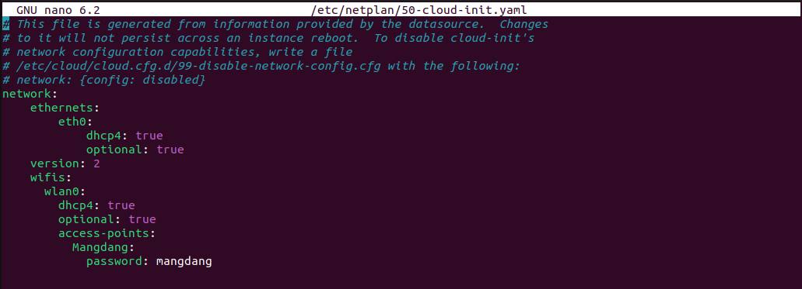
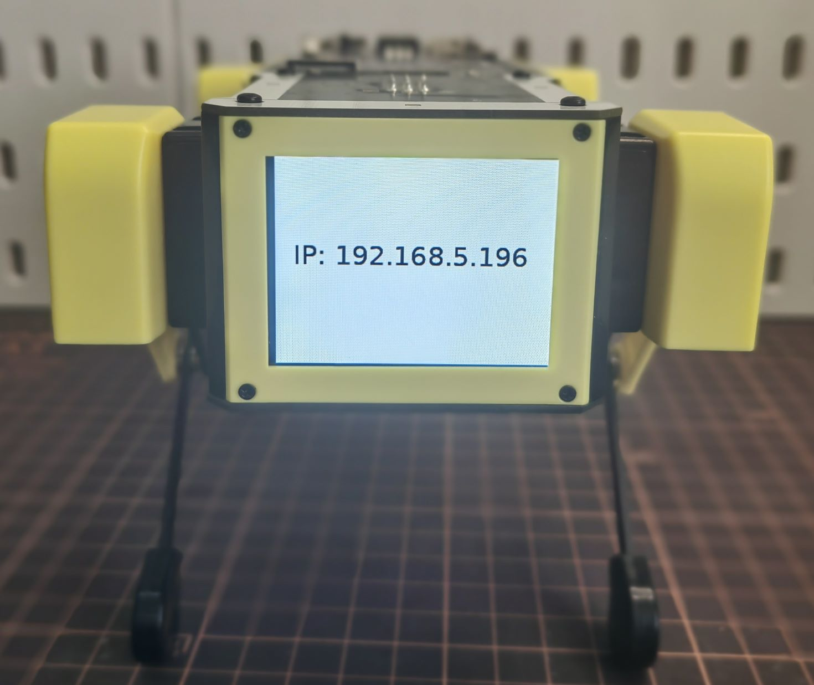

=================
ROS2 Installation
=================

.. contents::
  :depth: 2

Mini Pupper's ROS2 version is based on `Champ <https://github.com/chvmp/champ>`_  open source project, and we made some changes to SLAM and Navigation functions.

We recommend you explore Mini Pupper with ROS2 network, make sure your PC and Mini Pupper have connected to the same WiFi.

1. PC Setup
------------

PC Setup corresponds to PC (your desktop or laptop PC) for controlling Mini Pupper remotely. Do not apply these commands to your Mini Pupper.

**WARNING: The contents in this chapter corresponds to the Remote PC (your desktop or laptop PC) which will control Mini Pupper. Do not apply these commands to your Raspberry Pi on Mini Pupper or Compute Module 4 on Mini Pupper 2.**

**NOTE: This instruction was tested on Linux with Ubuntu 22.04 and ROS2 Humble.**

1.1 Install ROS 2 Humble
^^^^^^

Open the terminal with Ctrl+Alt+T from Remote PC. 

::

	cd ~
	sudo apt update
	git clone https://github.com/Tiryoh/ros2_setup_scripts_ubuntu.git
	~/ros2_setup_scripts_ubuntu/ros2-humble-ros-base-main.sh
	source /opt/ros/humble/setup.bash
	After ROS 2 installation, download the Mini Pupper ROS package in the workspace.

1.2 Install Mini Pupper ROS Repository
^^^^^^

Open the terminal with Ctrl+Alt+T from Remote PC.

::

	mkdir -p ~/ros2_ws/src
	cd ~/ros2_ws/src
	git clone https://github.com/mangdangroboticsclub/mini_pupper_ros.git -b ros2-dev mini_pupper_ros
	vcs import < mini_pupper_ros/.minipupper.repos --recursive

1.3 Install Dependent ROS 2 Packages and Build Package
^^^^^^

Open the terminal with Ctrl+Alt+T from Remote PC.

::

	cd ~/ros2_ws
	rosdep install --from-paths src --ignore-src -r -y
	sudo apt install ros-humble-teleop-twist-keyboard
	sudo apt install ros-humble-teleop-twist-joy
	colcon build --symlink-install

1.4. Export Robot Model
^^^^^^

1. Open ~/.bashrc with text editor in the terminal.

::

	nano ~/.bashrc

2. Scroll to the end of the file.

.. image:: ../_static/bashrc.png
    :align: center  

| 

3. Add the following line to export the robot model with the computer. Please use the proper keyword among mini_pupper, mini_pupper_2 for the ROBOT_MODEL parameter according to your robot model.

::

 	export ROBOT_MODEL=mini_pupper_2

4. Save the file with Ctrl+S and exit with Ctrl+X.
5. Run the following command to apply the change.

::

	source ~/.bashrc

2. Mini Pupper Setup
------------

You can also download the `pre-built ROS image <https://drive.google.com/drive/folders/12FDFbZzO61Euh8pJI9oCxN-eLVm5zjyi>`_ for Mini Pupper side, named "xxx.MiniPupper_ROS&OpenCV_Ubuntu20.04.03.img".

1.	The image can be flashed into the card using an adaptor. If you PC do not have a microSD slot, please use a microSD card reader to burn the image.
2.	Download ubuntu-22.04.2-preinstalled-server-arm64+raspi.img.xz from the official website, and flash it into your SD card according to the following guide.
3.	Plug the card into the Mini Pupper card port and setup your own wifi.

.. image:: ../_static/Sd-card-reader.jpg
    :align: center   

|

::

	sudo nano /etc/netplan/50-cloud-init.yaml

4.	When the editor is opened, edit the content as below while replacing Mangdang and mangdang with your actual wifi SSID and password.

5.	Save the file with Ctrl+S and exit with Ctrl+X.
6.	Run the following commands to reboot and connect to your actual wifi.

::

	sudo netplan apply
	sudo apt update
	sudo apt upgrade
	reboot

7. After reboot, open ~/.bashrc with text editor in the terminal.

::

	nano ~/.bashrc

8. Scroll to the end of the file.

.. image:: ../_static/bashrc.png
    :align: center 

|  

9. Add the following line to export the robot model with the computer. Please use the proper keyword among mini_pupper, mini_pupper_2 for the ROBOT_MODEL parameter according to your robot model.

::

	export ROBOT_MODEL=mini_pupper_2

10. Save the file with Ctrl+S and exit with Ctrl+X.
11. Run the following command to apply the change.

::

	source ~/.bashrc

3. Connecting Mini Pupper to PC
------------

1. Open two terminals with Ctrl+Alt+T twice, one for connecting to Mini Pupper and one for PC local.
2. Look at monitor of Mini Pupper to obtain the IP address of it.

3. Use one of the terminals and run the following command to connect to the Mini Pupper. The default password is “mangdang”.

::

	ssh ubuntu@{IP_ADDRESS_OF_MINI_PUPPER)

4. Open ~/.bashrc with text editor in both terminals.

::

	nano ~/.bashrc

5. Scroll to the end of the file for both terminals.

.. image:: ../_static/bashrc.png
    :align: center  

| 

6. Add the following line in both terminals to setup the connection. The number inputted can be any number, but it should be the same for both terminals.

::

	 export ROS_DOMAIN_ID=42

7. Save the file with Ctrl+S and exit with Ctrl+X.
8. Run the following command to apply the change.

::

	source ~/.bashrc

9. Use the following command in both terminals to confirm that the PC and the Mini Pupper are connected:

::

	ros2 node list

10. Compare the output in both terminals:

.. image:: ../_static/node-list.png
    :align: center   

|

If the output in both terminals shows the same list of node which is similar to the picture, your PC and the Mini Pupper is connected

**NOTE: the node list depends on the nodes in progress, which may not be exactly the same from the image.**
