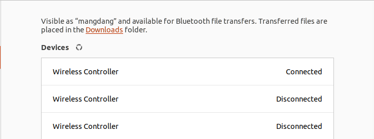
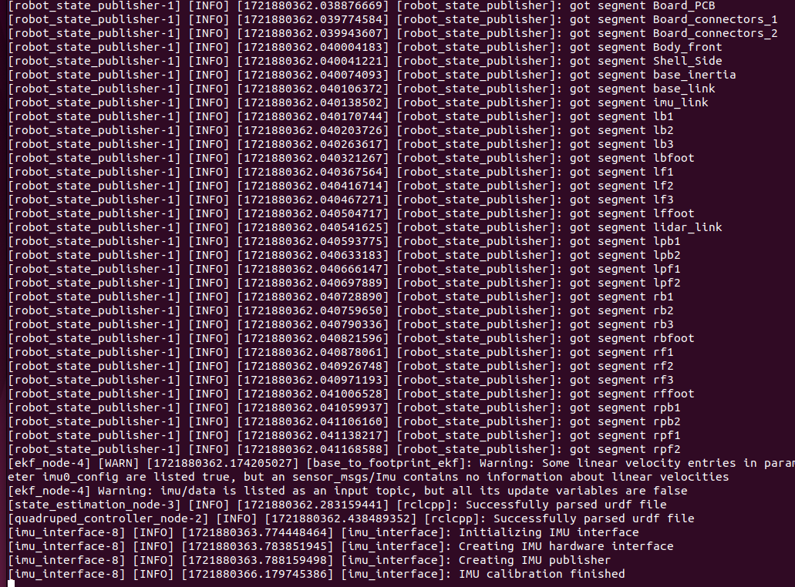

=================
ROS2 Quick Start
=================

.. contents::
  :depth: 2

1. Calibration
------------

Through this script, you can calibrate the angle of every servo in one turn. Just input the angles. 
The hip and shank should be horizontal, and the ham should be vertical.

::

	calibrate

Make sure Mini Pupper looks like this after calibrating.

.. image:: ../_static/109.jpg
    :align: center   

2. Joystick Setup
------------

1. Press the HOME button on the controller.
2. Search for available bluetooth devices on your PC and connect to it.

.. image:: ../_static/controller-address.png
    :align: center   

3. Use the following command to check the name of the joystick.

Terminal output: In this case the name of the joystick is “js0”.

.. image:: ../_static/dev-input.png
    :align: center   

4. Use the following command to check if the joystick us connected.

::
	sudo apt install joystick
	jstest /dev/input/{NAME_OF_JOYSTICK}

There will be output as followed if joystick is connected.

.. image:: ../_static/jstest.png
    :align: center   

3. Bringup
------------

1. Open a terminal with Ctrl+Alt+T  to connect Mini Pupper.
2. Look at monitor of Mini Pupper to obtain the IP address of it.
3. Use one of the terminals and run the following command to connect to the Mini Pupper. The default password is mangdang.

::

	ssh ubuntu@{IP_ADDRESS_OF_MINI_PUPPER)

4. Bring up basic packages to start Mini Pupper applications. 

::

	. ~/ros2_ws/install/setup.bash
	ros2 launch mini_pupper_bringup bringup.launch.py

When the robot model is Mini Pupper 2, the terminal output will look like below.

.. image:: ../_static/Bringup1.png
    :align: center   

5. Topics and services can be listed with commands below.

Topic list

::

	ros2 topic list

.. image:: ../_static/topic-list.png
    :align: center   

Service list

::

	ros2 service list

.. image:: ../_static/service-list.png
    :align: center   

4. Teleoporation
------------

**WARNING: Make sure to run the Bringup from the Mini Pupper before teleoperation. Teleoperate the robot, and be careful when testing the robot on the table as the robot might fall.**

4.1 Keyboard
^^^^^^

1. Open a terminal with Ctrl+Alt+T on remote PC.
2. Run teleoperation node using the following command.

::

	. ~/ros2_ws/install/setup.bash
	ros2 run teleop_twist_keyboard teleop_twist_keyboard

Terminal output: 

.. image:: ../_static/keyboard-teleop.png
    :align: center   

4.2 Joystick
^^^^^^

1. Open a terminal with Ctrl+Alt+T on remote PC.
2. Run teleoperation node using the following command.

::

	. ~/ros2_ws/install/setup.bash
	ros2 launch teleop_twist_joy teleop-launch.py joy_dev:=/dev/input/{NAME_OF_JOYSTICK}

Terminal output:

.. image:: ../_static/joystick-teleop-node.png
    :align: center  

