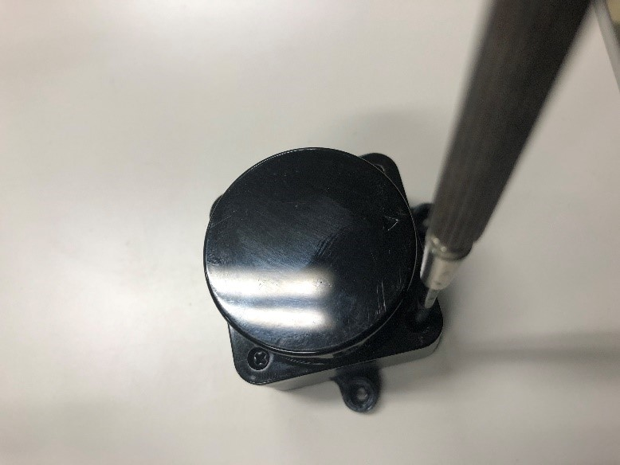
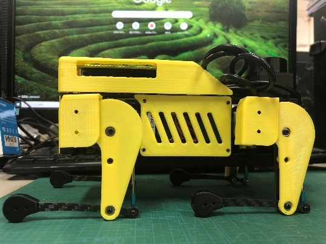
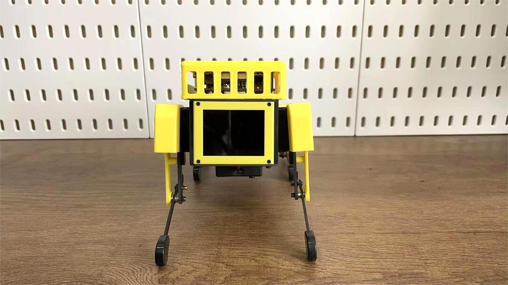

SLAM & Navigation  SLAM＆ナビゲーション
========

.. contents 目次:: :depth: 2

Software setup for the SLAM & Navigation functions. SLAM & Navigation機能のソフトウェアセットアップ。

1. Things to prepare 準備するもの
-------------

Tools 工具
^^^^^^^^^^^^^^^^^^^^^
In addition to the tools included in the kit, the following items are required for assembly. キットに同梱されている工具の他に、組み立てには以下の物が必要です。

* PC（OS：Ubuntu20.04）
* microSD card interface microSDカードリーダ  
* HDMI Display HDMI ディスプレイ 
* HDMI micro HDMI convertor HDMI⇔microHDMI変換 
* microUSB cable microUSB ケーブル 
* New SD card 新しいSDカード
* Wi-Fi(PC and MiniPupper must be on the same network) Wi-Fiの環境（PCとMiniPupperを同じネットワークにする必要ある）

2. Setup on the PC side PC側の環境セットアップ
-------------
Step 2.1 Download the image  イメージのダウンロード
^^^^^^^^^^^^^^^^^^^^^

* "MiniPupper2004.zip" is zip file of the image for the Ubuntu + ROS version for SLAM & Navigation. Download and unzip the zip file.「MiniPupper2004.zip」はSLAM＆NavigationのUbuntu + ROSバージョンのイメージのzipファイルです。ファイルをダウンロードして、解凍します。

  `MiniPupper2004.zip <https://drive.google.com/file/d/11zeivhN-fyTMdf6iuhcVD-Ib6aKj7s_5/view?usp=sharing>`_ 
  
Step 2.2 Write the image into microSD microSDにイメージを書く
^^^^^^^^^^^^^^^^^^^^^

Here we introduce the method of writing the image into microSD through Raspberry Pi's Imager. ここでは、RaspberryPiのImagerを使用してイメージをmicroSDに書き込む方法を紹介します。

* Install the Imager tool of the Raspberry Pi. RaspberryPiのImagerツールをインストール

::

	snap install rpi-imager
    
* Write the image into the new SD card.  新しいSDカードにイメージを書き込みます。
.. image:: ../_static/148.gif
    :align: center

Step 2.3 Install ROS noetic ROS noeticをインストールする
^^^^^^^^^^^^^^^^^^^^^

* You can skip this step if you have already installed ROS noetic. Basically you can follow the instructions on http://wiki.ros.org/noetic/Installation/Ubuntu. ROS noeticをすでにインストールしている場合は、この手順をスキップできます。基本的に、http://wiki.ros.org/noetic/Installation/Ubuntu の指示に従うことができます。

Step 2.4 Cartographer_ros environment setup Cartographer_rosの環境セットアップ
^^^^^^^^^^^^^^^^^^^^^

::

	cd ~
	sudo apt-get update 
	sudo apt-get install -y python3-wstool python3-rosdep ninja-build stow
	mkdir carto_ws
	cd carto_ws
	wstool init src
	wstool merge -t src https://raw.githubusercontent.com/cartographer-project/cartographer_ros/master/cartographer_ros.rosinstall
	wstool update -t src
	sudo rosdep init
	rosdep update
	rosdep install --from-paths src --ignore-src --rosdistro=${ROS_DISTRO} -y
	src/cartographer/scripts/install_abseil.sh
	sudo apt-get remove ros-${ROS_DISTRO}-abseil-cpp
	catkin_make_isolated --install --use-ninja
	source install_isolated/setup.bash

Step 2.5 Compile the package for Mini Pupper ROS Mini Pupper ROS用のパッケージをコンパイル
^^^^^^^^^^^^^^^^^^^^

* Download the required package `mnpp_ws.zip <https://drive.google.com/file/d/1gbuvy29hNnS3Ep2o_uR8qAYnFKkr7Dj4/view?usp=sharing>`_  and unzip it to home. 必要なパッケージ `mnpp_ws.zip <https://drive.google.com/file/d/1gbuvy29hNnS3Ep2o_uR8qAYnFKkr7Dj4/view?usp=sharing>`_ をダウンロードして、homeに解凍します。

.. image:: ../_static/149.gif
    :align: center
    
* Compile the package. パッケージをコンパイルします。

::

	cd ~/mnpp_ws/
	sudo apt-get install libudev-dev
	rosdep install --from-paths src --ignore-src -r -y
	catkin_make
	source ~/mnpp_ws /devel/setup.bash

.. image:: ../_static/150.gif
    :align: center
    
Step 2.6 Network setup ネットワークのセットアップ
^^^^^^^^^^^^^^^^^^^^^

* Connect your PC and MiniPupper to the same WiFi and find the IP address assigned by the command ifconfig. PCとMiniPupperを同じWiFiに接続して、コマンドifconfigで割り当てられたIPアドレスを見つけます。

::

	ifconfig
	
* Open the bashrc file. bashrcファイルを開きます。

::

	sudo gedit ~/.bashrc

* Update the ROS IP settings with the following command to add the master and hostname configuration in the bashrc file. 以下のコマンドでROSのIP設定を更新して、マスターとホスト名の構成をbashrcファイルに追加します。

※ 192.168.1.7 is the IP of the PC. you need to enter the IP of your PC. 192.168.1.7はPCのIPです。 PCのIPを入力する必要があります。

::

	export ROS_MASTER_URI=http://192.168.1.7:11311
	export ROS_HOSTNAME=192.168.1.7
	source ~/carto_ws/install_isolated/setup.bash
	source ~/mnpp_ws/devel/setup.bash

* Source the .bashrc file. 

::

	source ~/.bashrc
		
.. image:: ../_static/151.gif
    :align: center

3. Setup on the MiniPupper side MiniPupper側の環境セットアップ
-------------

Step 3.1 Replace the new SD card 新しいSDカードを入れ替わる
^^^^^^^^^^^^^^^^^^^^^

.. image:: ../_static/152.gif
    :align: center

Step 3.2 Attach Lidar Lidarの取り付け
^^^^^^^^^^^^^^^^^^^^^

※ You can use a shorter USB cable to connect the Lidar and MiniPupper. もっと短いUSBケーブルを使用して、LidarとMiniPupperを接続できます。

* Place Lidar on the Stand and tighten with tapping screws (2 pieces).  Lidarを台の上に載せて、タッピングビス（2個）で締めます。

* Attach Lidar to Mini Pupper LidarをMiniPupperに取り付ける

.. image:: ../_static/154.gif
    :align: center

Step 3.3 Network setup ネットワークのセットアップ
^^^^^^^^^^^^^^^^^^^^^

* Connect the MiniPupper to the HDMI display, then power on. MiniPupperをHDMIディスプレイに接続し、電源を入れます。

* Connect your PC and MiniPupper to the same WiFi and find the IP address assigned by the command ifconfig. PCとMiniPupperを同じWiFiに接続して、コマンドifconfigで割り当てられたIPアドレスを見つけます。

::

	ifconfig
	
* Open the bashrc file. bashrcファイルを開きます。

::

	sudo gedit ~/.bashrc

* Update the ROS IP settings with the following command to add the master and hostname configuration in the bashrc file. 以下のコマンドでROSのIP設定を更新して、マスターとホスト名の構成をbashrcファイルに追加します。

※ 192.168.1.7 is the IP of the PC. you need to enter the IP of your PC. 192.168.1.7はPCのIPです。 PCのIPを入力する必要があります。

※ 192.168.1.4 is the IP of the raspberry Pi. you need to enter the IP of your raspberry Pi. 192.168.1.4はラズベリーパイのIPです。 ラズベリーパイのIPを入力する必要があります。

::

	export ROS_MASTER_URI=http://192.168.1.7:11311	
	export ROS_HOSTNAME=192.168.1.4

* Source the .bashrc file. 

::

	source ~/.bashrc
		
.. image:: ../_static/155.gif
    :align: center

Step 3.4 Automatic time update settings 時間の自動更新の設定
^^^^^^^^^^^^^^^^^^^^^

* Set the correct time zone to your country. お住まいの国に正しいタイムゾーンを設定してください。

The video is shown as below. ビデオは以下のように表示されます。

.. raw:: html

    

         <iframe width="560" height="315" src="https://www.youtube.com/embed/ZZD2K0wOsPg" title="YouTube video player" frameborder="0" allow="accelerometer; autoplay; clipboard-write; encrypted-media; gyroscope; picture-in-picture" allowfullscreen></iframe>
    

Step 3.5 Modify the IO settings IO設定の変更
^^^^^^^^^^^^^^^^^^^^^

* You need to change the IO settings if you use the V2 custom circut board. If you use the V1 verson, you can skip. V2カスタム基板を使用する場合はIO設定を変更する必要があります。V1バージョンを使用する場合は、スキップしてください。

The video is shown as below. ビデオは以下のように表示されます。

.. raw:: html

    

         <iframe width="560" height="315" src="https://www.youtube.com/embed/QKX6Qylk74A" title="YouTube video player" frameborder="0" allow="accelerometer; autoplay; clipboard-write; encrypted-media; gyroscope; picture-in-picture" allowfullscreen></iframe>
    

Step 3.6 Calibrate the servomotor サーボモーターのキャリブレーション
^^^^^^^^^^^^^^^^^^^^^

Here we introduce how to calibrate the servomotors of MiniPupper through SSH after MiniPupper and PC connected to the same WiFi. ここでは、MiniPupperとPCを同じWiFiに接続した後、SSHを介してMiniPupperのサーボモーターを調整する方法を紹介します。

* Enter the roscore command on the PC side. PC側でroscoreコマンドを入れます。

::

	# First Terminal	
	roscore

* Access MiniPupper with ssh on the PC side. Enter the command on the PC side. PC側sshでMiniPupperをアクセスします。PC側でコマンドを入れます。

※ 192.168.1.4 is the IP of the raspberry Pi. you need to enter the IP of your raspberry Pi. 192.168.1.4はラズベリーパイのIPです。 ラズベリーパイのIPを入力する必要があります。

::

	# Second Terminal	
	ssh ubuntu@192.168.1.4	
	password: mangdang	 
	roslanuch servo_interface calibrate.launch

* The target posture of calibration is shown as follows. To save power, you can disconnect the Lidar USB cable. カリブレーションの目標姿勢は以下のようになります。電力を節約するために、Lidar USBケーブルを外すことができます。

    
The video is shown as below. ビデオは以下のように表示されます。

.. raw:: html

    

         <iframe width="560" height="315" src="https://www.youtube.com/embed/TY39yKRGzKU" title="YouTube video player" frameborder="0" allow="accelerometer; autoplay; clipboard-write; encrypted-media; gyroscope; picture-in-picture" allowfullscreen></iframe>
    

4. Run MiniPupper ミニぷぱを動かす
-------------
MiniPupper can be controlled with Keyboard or PS4 controller. ミニぷぱはキーボードまたはPS4コントローラーで制御できます。

Step 4.1 Control from the keyboard of PC. PCのキーボードからの制御
^^^^^^^^^^^^^^^^^^^^^

* Enter the roscore command on the PC side. PC側でroscoreコマンドを入れます。

::

	# First Terminal	
	roscore

* Access MiniPupper with ssh on the PC side. Enter the command on the PC side. PC側sshでMiniPupperをアクセスします。PC側でコマンドを入れます。

※ 192.168.1.4 is the IP of the raspberry Pi. you need to enter the IP of your raspberry Pi. 192.168.1.4はラズベリーパイのIPです。 ラズベリーパイのIPを入力する必要があります。

::

	# Second Terminal
	ssh ubuntu@192.168.1.4	
	password: mangdang	 
	roslanuch mini_pupper bringup.launch
	
* Enter the keyboard control node command on the PC side. PC側でキーボード制御ノードコマンドを入力します。

::

	# Third Terminal	
	roslanuch champ_teleop teleop.launch

The operation video is shown as below. 操作動画は以下のとおりです。

.. raw:: html

    

         <iframe width="560" height="315" src="https://www.youtube.com/embed/RypJM2pazXU" title="YouTube video player" frameborder="0" allow="accelerometer; autoplay; clipboard-write; encrypted-media; gyroscope; picture-in-picture" allowfullscreen></iframe>
    

Step 4.2 Control from the PS4 controller. PS4コントローラーでの制御
^^^^^^^^^^^^^^^^^^^^^

* Enter the roscore command on the PC side. PC側でroscoreコマンドを入れます。

::

	# First Terminal	
	roscore

* Access MiniPupper with ssh on the PC side. Enter the command on the PC side. PC側sshでMiniPupperをアクセスします。PC側でコマンドを入れます。

※ 192.168.1.4 is the IP of the raspberry Pi. you need to enter the IP of your raspberry Pi. 192.168.1.4はラズベリーパイのIPです。 ラズベリーパイのIPを入力する必要があります。

::

	# Second Terminal
	ssh ubuntu@192.168.1.4	
	password: mangdang	 
	roslanuch mini_pupper bringup.launch
	
* Enter the PS4 control node command on the MiniPupper side. ミニぷぱ側でPS4制御ノードコマンドを入力します

::

	# Third Terminal
	ssh ubuntu@192.168.1.4	
	password: mangdang	
	roslaunch ps4_interface ps4_interface.launch	

* Next, pair with PS4 (wait for about 5 seconds). The joystick on the left controls driving forward, backward, left and right. The joystick on the right controls rotation. The cross key controls the standing height and the angle of the roll axis. If you are pressing R2, use the right joystick to control the pitch angle and yaw axis. Press L2 and the robot will return to its default state. 次に、PS4とのペアリングモードします（5秒ぐらい待つ）。左のジョイスティックは前後左右の走行を制御します。右のジョイスティックは回転を制御します。十字キーは、立っている高さとロール軸の角度を制御します。R2を押している場合は、右のジョイスティックでピッチ角とヨー軸を制御します。L2を押すと、ロボットはデフォルトの状態に戻ります。

The operation video is shown as below. 操作動画は以下のとおりです。

.. raw:: html

    

         <iframe width="560" height="315" src="https://www.youtube.com/embed/Nnf1NREHnrA" title="YouTube video player" frameborder="0" allow="accelerometer; autoplay; clipboard-write; encrypted-media; gyroscope; picture-in-picture" allowfullscreen></iframe>
    

    
5. Create a 2D map 2D地図作成
-------------
 
Step 5.1 Start cartographer on the PC side PC側でcartographerを起動する
^^^^^^^^^^^^^^^^^^^^^
 
::
 
	# First Terminal	
	cd ~	
	source ~/carto_ws/install_isolated/setup.bash	
	roslaunch mini_pupper slam.launch
	
Step 5.2 MiniPupper setup ミニぷぱセットアップ
^^^^^^^^^^^^^^^^^^^^^
 
※ Lidar USB plugged state.  LidarUSBが接続された状態。

* Access MiniPupper with ssh on the PC side. Enter the command on the PC side. PC側sshでMiniPupperをアクセスします。PC側でコマンドを入れます。

※ 192.168.1.4 is the IP of the raspberry Pi. you need to enter the IP of your raspberry Pi. 192.168.1.4はラズベリーパイのIPです。 ラズベリーパイのIPを入力する必要があります。

::

	# Second Terminal
	ssh ubuntu@192.168.1.4	
	password: mangdang	 
	roslanuch mini_pupper bringup.launch

Step 5.3 Create map 地図作成
^^^^^^^^^^^^^^^^^^^^^

* Run MiniPupper on the PC side to create a 2D map (using the operation from the Keyboard as an example). PC側でMiniPupperを動かして、２D地図を作成します（Keyboardからの操作を例とする）。

::

	# Third Terminal	
	roslanuch champ_teleop teleop.launch
 
Step 5.4 Save the 2D map on the PC side PC側で２D地図の保存
^^^^^^^^^^^^^^^^^^^^^
 
::

 	# Fourth Terminal
	source ~/carto_ws/install_isolated/setup.bash	
	rosservice call /finish_trajectory 0	
	rosservice call /write_state "{filename: '${HOME}/map.pbstream'}"	
	rosrun cartographer_ros cartographer_pbstream_to_ros_map -map_filestem=${HOME}/map -pbstream_filename=${HOME}/map.pbstream -resolution=0.05 
	
 
The operation video is shown as below. 操作動画は以下のとおりです。

Video of PC operation PC操作の動画

.. raw:: html

    

         <iframe width="560" height="315" src="https://www.youtube.com/embed/g4b2ASLeuHc" title="YouTube video player" frameborder="0" allow="accelerometer; autoplay; clipboard-write; encrypted-media; gyroscope; picture-in-picture" allowfullscreen></iframe>
    

Actual machine video 実機動画

.. raw:: html

    

         <iframe width="560" height="315" src="https://www.youtube.com/embed/wH8Fh6cgv-0" title="YouTube video player" frameborder="0" allow="accelerometer; autoplay; clipboard-write; encrypted-media; gyroscope; picture-in-picture" allowfullscreen></iframe>
    

    
 
6. Navigation ナビゲーション
-------------

Step 6.1 Move the saved mapto the related folder 保存したマップを関連フォルダに移動
^^^^^^^^^^^^^^^^^^^^^

* Move the saved map.pbstream, map.pgm and map.yaml to src/minipupper_ros/mini_pupper/maps on your PC. 保存できた map.pbstream / map.pgm / map.yaml は、 PC の、src/minipupper_ros/mini_pupper/maps に移動します。

Step 6.2  Execute Navigation Launch on the PC side PC側でナビゲーション起動を実行
^^^^^^^^^^^^^^^^^^^^^

* Continued from step 5.1 (after closing roslaunch mini_pupper slam.launch with ctl + c). 手順5.1から続行します（ctl + cを使用してroslaunchmini_pupper slam.launchを閉じた後）。

::

	roslaunch mini_pupper navigate.launch

Step 6.3 Set the target position 目標位置を設定する
^^^^^^^^^^^^^^^^^^^^^

* On the PC side, specify the target of the map where rviz is displayed. PC側で、rvizが表示される地図の目標位置を設定します。

Step 6.4  Autonomous driving 自律走行
^^^^^^^^^^^^^^^^^^^^^

The operation video is shown as below. 操作動画は以下のとおりです。

Video of PC operation PC操作の動画

.. raw:: html

    

         <iframe width="560" height="315" src="https://www.youtube.com/embed/iceGoDllBIo" title="YouTube video player" frameborder="0" allow="accelerometer; autoplay; clipboard-write; encrypted-media; gyroscope; picture-in-picture" allowfullscreen></iframe>
    

Actual machine video 実機動画

.. raw:: html

    

         <iframe width="560" height="315" src="https://www.youtube.com/embed/nzeWLWBDPRU" title="YouTube video player" frameborder="0" allow="accelerometer; autoplay; clipboard-write; encrypted-media; gyroscope; picture-in-picture" allowfullscreen></iframe>
    

 
7. Others その他
-------------
 
Let's install an ordinary USB camera. 普通のUSBカメラを搭載してみよう。

Step 7.1 PC side　PC側
^^^^^^^^^^^^^^^^^^^^^

::

 	# First Terminal	
	roscore

Step 7.2 MiniPupper side ミニぷパ側
^^^^^^^^^^^^^^^^^^^^^

::

	# Second Terminal	
	roslaunch usb_cam usb_cam-test.launch

Step 7.3 PC side　PC側
^^^^^^^^^^^^^^^^^^^^^

Launch rqt_image_view and watch the video. rqt_image_viewを立ち上げて映像をみます。

::

	# Third Terminal	
	rqt_image_view
 

