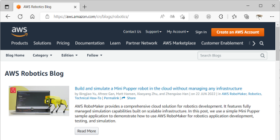
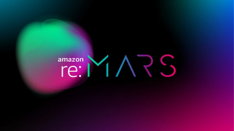

Simulation
==============================

.. contents::
  :depth: 2

Instructions for Creating an AWS RoboMaker Environment for Mini Pupper, please refer to

https://github.com/mangdangroboticsclub/aws-robomaker-mini-pupper-application/

Instructions for Amazon AWS Robotics Blog, please refer to

https://aws.amazon.com/blogs/robotics/build-and-simulate-a-mini-pupper-robot-in-the-cloud-without-managing-any-infrastructure/

Instructions for Amazon 2022 re:MARS RoboMaker&MiniPupper Workshop, please refer to

https://catalog.us-east-1.prod.workshops.aws/workshops/511d7599-73bd-4142-bd6b-fa83dbe3d8ce/en-US

