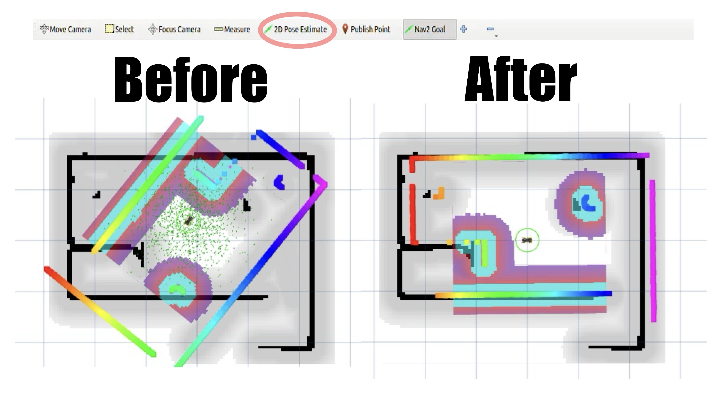

==============================
Simulation
==============================

.. contents::
  :depth: 2

* Mini Pupper's ROS2 installation package is `ros2_setup_scripts <https://github.com/Tiryoh/ros2_setup_scripts_ubuntu>`_  provided by one of our contributor @Tiryoh.
* Mini Pupper's ROS2 version is based on `Champ <https://github.com/chvmp/champ>`_  open source project, and we made some changes to SLAM and Navigation functions.
* Mini Pupper's software supporting lidar sensor is based on `ldlidar_stl_ros2 <https://github.com/ldrobotSensorTeam/ldlidar_stl_ros2>`_  open source project.

The following steps allows us to simulate the teleoperation, SLAM and Navigation of Mini Pupper using RViz and Gazebo.

**NOTE: Please run the Simulation on Remote PC.**

1. RViz Simulation
------------

1.1 Launch Simulation World
^^^^^^

1. Run the following command to launch bringup the robot simulation without connecting to the robot.

::

  . ~/ros2_ws/install/setup.bash
  ros2 launch mini_pupper_bringup bringup.launch.py hardware_connected:=False

2. Run the following command to launch RViz simulation.

::

  . ~/ros2_ws/install/setup.bash
  ros2 launch mini_pupper_bringup rviz.launch.py

1.2. Teleoperation
^^^^^^

* 1.2.1 Keyboard

1. Open a terminal with Ctrl+Alt+T on remote PC.
2. Run teleoperation node using the following command.

::

  . ~/ros2_ws/install/setup.bash
  ros2 run teleop_twist_keyboard teleop_twist_keyboard

* 1.2.2 Joystick

1. Open a terminal with Ctrl+Alt+T on remote PC.
2. Run teleoperation node using the following command.

::

  . ~/ros2_ws/install/setup.bash
  ros2 launch teleop_twist_joy teleop-launch.py joy_dev:=/dev/input/{NAME_OF_JOYSTICK}

The following video demonstrates the teleoperation simulation under RViz.

.. raw:: html

    

        <iframe width="560" height="315" src="https://www.youtube.com/embed/O1OXINLR1KQ" frameborder="0" allow="accelerometer; autoplay; encrypted-media; gyroscope; picture-in-picture" allowfullscreen></iframe>
    

|

2. Gazebo Simulation
------------

2.1 Launch Simulation World
^^^^^^

1. Run the following command to launch Gazebo simulation.

::

  . ~/ros2_ws/install/setup.bash
  ros2 launch mini_pupper_gazebo gazebo.launch.py

2.2. Teleoperation:
^^^^^^

* 2.2.1 Keyboard

1. Open a terminal with Ctrl+Alt+T on remote PC.
2. Run teleoperation node using the following command.

::

  . ~/ros2_ws/install/setup.bash
  ros2 run teleop_twist_keyboard teleop_twist_keyboard

* 2.2.2 Joystick

1. Open a terminal with Ctrl+Alt+T on remote PC.
2. Run teleoperation node using the following command.

::

  . ~/ros2_ws/install/setup.bash
  ros2 launch teleop_twist_joy teleop-launch.py joy_dev:=/dev/input/{NAME_OF_JOYSTICK}

The following video demonstrates the teleoperation simulation under Gazebo.

.. raw:: html

    

        <iframe width="560" height="315" src="https://www.youtube.com/embed/O32Zwc3Fqok" frameborder="0" allow="accelerometer; autoplay; encrypted-media; gyroscope; picture-in-picture" allowfullscreen></iframe>
    

|

3. Test SLAM (Mapping) in Gazebo
------------

3.1 Launch Simulation World
^^^^^^

Run the following command to launch Gazebo simulation.

::

 . ~/ros2_ws/install/setup.bash
 ros2 launch mini_pupper_gazebo gazebo.launch.py

3.2 Run SLAM Node
^^^^^^

Open a new terminal from Remote PC with Ctrl + Alt + T and launch the SLAM node.

::

  . ~/ros2_ws/install/setup.bash
  ros2 launch mini_pupper_slam slam.launch.py use_sim_time:=true

3.3 Teleoperation
^^^^^^

* 3.3.1 Keyboard

1. Open a terminal with Ctrl+Alt+T on remote PC.
2. Run teleoperation node using the following command.

::

  . ~/ros2_ws/install/setup.bash
  ros2 run teleop_twist_keyboard teleop_twist_keyboard

* 3.3.2 Joystick

1. Open a terminal with Ctrl+Alt+T on remote PC.
2. Run teleoperation node using the following command.

::

  . ~/ros2_ws/install/setup.bash
  ros2 launch teleop_twist_joy teleop-launch.py joy_dev:=/dev/input/{NAME_OF_JOYSTICK}

The following video demonstrates the simulation of SLAM under RViz.

.. raw:: html

    

        <iframe width="560" height="315" src="https://www.youtube.com/embed/YynF3ozGdUo" frameborder="0" allow="accelerometer; autoplay; encrypted-media; gyroscope; picture-in-picture" allowfullscreen></iframe>
    

|

3.4 Save the map
^^^^^^

1. Open a terminal with Ctrl+Alt+T on remote PC.
2. Use the following command to launch the map_saver_cli node in the nav2_map_server package to create map files.

•	The map file is saved in the directory where the map_saver_cli node is launched at.

::

  . ~/ros2_ws/install/setup.bash
  ros2 run nav2_map_server map_saver_cli -f ~/map 

4. Navigation Simulation
------------

4.1 Launch Simulation World
^^^^^^

Run the following command to launch Gazebo simulation.

::

  . ~/ros2_ws/install/setup.bash
  ros2 launch mini_pupper_gazebo gazebo.launch.py

4.2 Launch Navigation Simulation
^^^^^^

Open a new terminal from Remote PC with Ctrl + Alt + T and launch the Navigation node. 

::

  . ~/ros2_ws/install/setup.bash
  ros2 launch mini_pupper_navigation navigation.launch.py use_sim_time:=true

If you wish to use the map you generated in previous step, you can specify the map path with the following command. 

::

  . ~/ros2_ws/install/setup.bash
  ros2 launch mini_pupper_navigation navigation.launch.py use_sim_time:=true map:=$HOME/map.yaml

The map used in navigation is two-dimensional Occupancy Grid Map (OGM). The white area is collision free area while black area is occupied and inaccessible area, and gray area represents the unknown area.

4.3 Estimate Initial Pose
^^^^^^

1. Click the 2D Pose Estimate button in the RViz2 menu.
2. Click on the map on location of the robot simulation relative to the map, drag the green arrow, the root of the arrow is the position of the robot simulation while the direction of the arrow will be the orientation of the robot simulation.
3. Repeat step 1 and 2 until the inaccessible area detected by the robot is overlapping completely with the black area on the map.

4.4 Set Navigation Goal
^^^^^^

1. Click the Nav2 Goal button in the RViz2 menu. A path will be planned to guide the robot simulation towards the destination.
2. Click on the map to set the destination of the robot simulation and drag the green arrow toward the direction where the robot simulation will be facing, while the root of the green arrow is the destination at which the robot simulation will finally reach.

.. image:: ../_static/Nav2.png
    :align: center  

|

The following video demonstrates the simulation of navigation under RViz.

.. raw:: html

    

        <iframe width="560" height="315" src="https://www.youtube.com/embed/77gWrRvZ-Zo" frameborder="0" allow="accelerometer; autoplay; encrypted-media; gyroscope; picture-in-picture" allowfullscreen></iframe>
    

|

