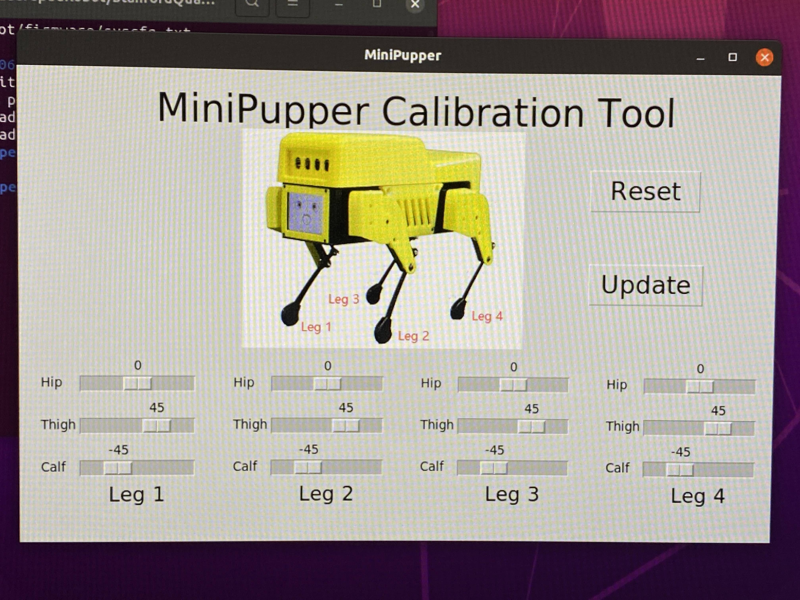
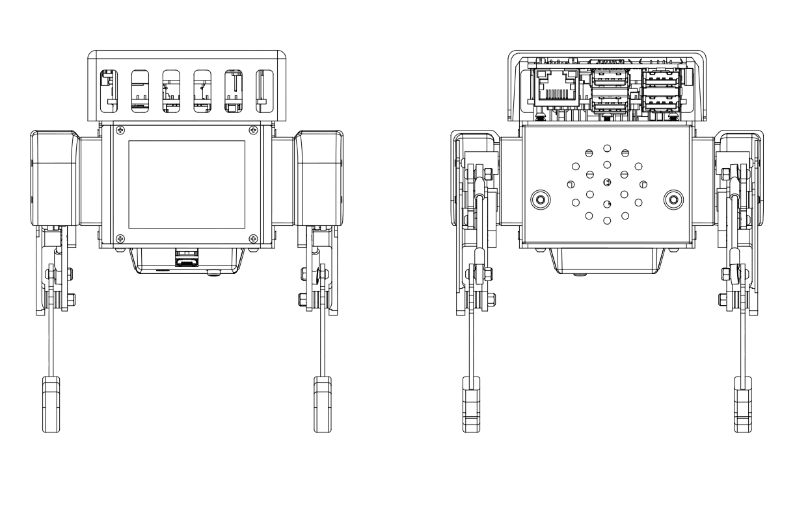
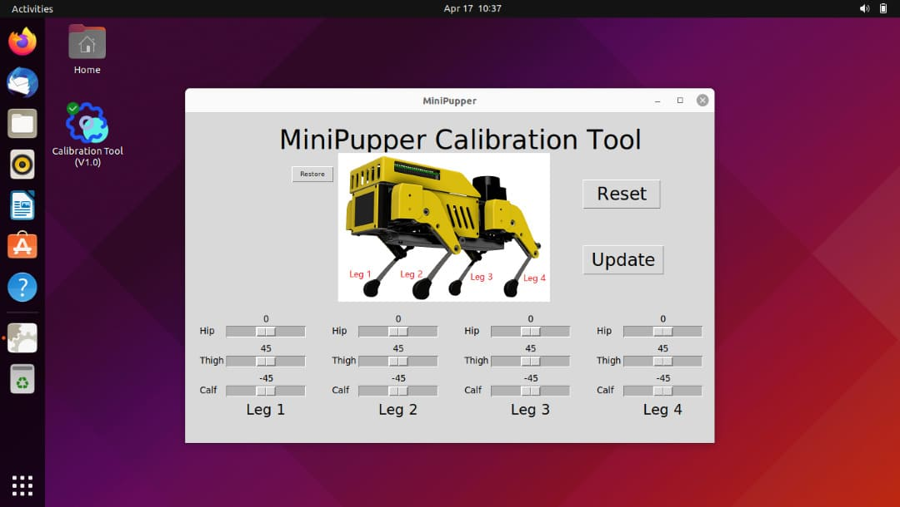

Software ソフトウェア
========

.. contents 目次:: :depth: 2

Software setup for the basic functions. 基本機能のソフトウェアセットアップ。

1. Software Setup ソフトウェアセットアップ
-------------

Tools 工具
^^^^^^^^^^^^^^^^^^^^^
In addition to the tools included in the kit, the following items are required for assembly. キットに同梱されている工具の他に、組み立てには以下の物が必要です。

* USB keyboardUSB キーボード 
* USB mouse USB マウス 
* PC
* microSD card interface microSDカードリーダ  
* HDMI DisplayHDMI ディスプレイ 
* HDMI microHDMI convertorHDMI⇔microHDMI変換 
* microUSB cable microUSB ケーブル 
* USB charger

Step 1.1 Startup raspberry pi ラズパイの起動
^^^^^^^^^^^^^^^^^^^^^

* Connect the Raspberry pi to the display with a microHDMI cable. ラズパイとディスプレイの間をmicroHDMIケーブルで繋ぐ
* Connect a USB keyboard and mouse to the Raspberry pi. USBのキーボードとマウスをラズパイに繋ぐ
* Press and hold the button on the bottom of the Mini Pupper to start Raspberry pi for three seconds. Mini Pupperの底にあるボタンを3秒長押しして、起動します。
* If you can see Ubuntu running on your screen, you have succeeded. You should also see the face on Mini Pupper display. If you don't see both screen, then you have followed the instructions incorrectly. 画面にUbuntuの起動している様子が映れば成功です。さらに、Mini Pupperの画面も表示されます。もし表示されない場合は、これまで行った手順に誤りがあります。

.. image:: ../_static/101.jpg
    :align: center 

Step 1.2  Log in ログイン
^^^^^^^^^^^^^^^^^^^^^

* Press ubuntu on the purple screen to log in. 紫の画面でubuntuを押してログインします。
* Default username / 初期ユーザ名:ubuntu
* Default password / 初期パスワード：mangdang
* You should change your password. パスワードは各自変更しましょう。

Step 1.3  Set keyboard キーボードの設定
^^^^^^^^^^^^^^^^^^^^^

* If you are using a Japanese keyboard, you will need this setting. Press the menu button in the bottom left corner and type settings to bring up settings. 日本語キーボードを使ってる場合、この設定が必要です。左下のメニューボタンを押し、 settings とタイプして設定を起動します。

.. image:: ../_static/102.jpg
    :align: center 

* Select Region & Language and press + for Input Sources. On the screen that comes up, select the three dots for other and type Japanese to select it. Type Japanese to select it. Region & Language を選択し、Input Sourcesの＋を押します。出てきた画面で点3つを選ぶとotherが出るので、 Japanese とタイプして選択します。English(US)はゴミ箱マークを押して消してしまってもOKです。

Step 1.4  Enable wifi Wifiの有効化
^^^^^^^^^^^^^^^^^^^^^

* Press the menu button at the bottom left and type terminal to start the terminal. In the terminal, open the configuration file. 左下のメニューボタンを押し、 terminal とタイプしてターミナルを起動します。ターミナルで、設定ファイルを開きます。

::

	sudo gedit /boot/firmware/syscfg.txt
	
* Type # to enable disabled wifi on syscfg.txt. syscfg.txtにはdtoverlay=disable-wifiと書かれているので、#を付けてコメントアウトします。

::

	# dtoverlay=disable-wifi

* Reboot Ubuntu to enable wifi. ここで一度再起動して、設定を反映しましょう。

* When you start up again, open settings and set up your wifi settings. Choose your wifi access point SSID and enter your password. 再び起動したら、settingsを開いてWifiの設定をします。自分のWifiアクセスポイントのSSIDを選び、パスワードを入れましょう。

* Type ip a. See and make a note of IP address. This will be necessary when you connect to your PC via ssh. The configuration within Ubuntu is now complete. ターミナルで ip a とタイプし、ラズパイに割り振られたIPアドレスを確認します。PCからsshで接続するときに必要になるのでメモしておきましょう。Ubuntu内の設定はこれで完了です。

Step 1.5 Open ports for ssh / ssh接続のためのポート開放
^^^^^^^^^^^^^^^^^^^^^

* Attempt to make an ssh connection from your PC to Ubuntu. PCからUbuntuにssh接続を試みます。

::

	ssh ubuntu@192.168.x.x -p 22

* If you are unable to make an ssh connection from your PC, you will need to configure the following, maybe. PCからssh接続できない場合、下記の設定が必要です。

::

	sudo ufw allow 22
	sudo ufw reload
	
* If firewall is not running, do the following. もしファイアーウォールが起動してないと言われたら以下を実行します。

::

	sudo ufw enable

2. calibration キャリブレーション
-------------

Step 2.1 Leg servos 
^^^^^^^^^^^^^^^^^^^^^

* The first step is to make the Mini Pupper stand up, so that legs touch the floor. まずMini Pupperのすべての脚が床に触れるように立たせます。
* Double-click on the Calibration Tool icon on your desktop to launch it. Note that the legs will move when you run above python script. デスクトップのCalibration Toolアイコンをダブルクリックして起動します。アプリを起動したら、脚が動くので注意です。

.. image:: ../_static/103.png
    :align: center 
    
* Next, for each leg, move the Thigh and Calf bars so that they are at a 45 degree angle. The angle of the legs will change in conjunction with the position of the slide bar on the screen. However, if it does not move, then the steps you have followed are incorrect. 次に、それぞれの脚について、ThighとCalfのバーを動かし、45度の角度になるように調整します。要は ＞ ＞ の形にします。画面のスライドバーの位置に連動して脚の角度が変化します。しかし、動かない場合は、これまで行った手順に誤りがあります。

    
.. image:: ../_static/105.png
    :align: center  
    

    
* You can use the iPhone's tilt sensor app, a ruler or a protractor to measure the angle. I also used a ruler and a protractor. iPhoneの傾斜センサーアプリ、定規、分度器を使用して角度を測定できます。

.. image:: ../_static/106.jpg
    :align: center    
    
* It is not enough to measure the inclination of the legs, so it is important to place the legs on a grid, like a piece of graph paper, to check that they are in the same position from front to back and from side to side, and to make any final adjustments. 傾きの測定だけでは脚の位置が揃わないので、方眼紙のようなマス目に脚を置いて、前後左右の位置が一致しているか、確認し最終調整しましょう。

.. image:: ../_static/107.jpg
    :align: center    
    
* When all legs are at 45° inclination as shown, press Update to save the settings. Press × to close the calibration application. すべての脚を図のように45度の傾きになったら、Update を押して設定を保存します。×ボタンを押してキャリブレーションアプリを閉じます。
* As a tip, the calibration requires GUI and could not be done via ssh. 補足ですが、キャリブレーションはGUIが必要なのでsshでは実行出来ませんでした。

※ For the latest image file of the Ubuntu21.10, the target angles of legs are shown as below. Ubuntu 21.10の最新のイメージファイルの場合、脚の目標角度は次のようになります。

    
.. image:: ../_static/109.jpg
    :align: center   
    
.. image:: ../_static/110.jpg
    :align: center   

Step 2.2 Connect PS4 controller Playstation4コントローラの接続
^^^^^^^^^^^^^^^^^^^^^

* Please check the next chapter. 次の章を参照ください。

* If you can control it with a ps4 controller, it's OK. ps4コントローラで操作できればOKです。

Step 2.3 Shutdown Raspberry pi & Ubuntu ラズパイ&Ubuntuのシャットダウン
^^^^^^^^^^^^^^^^^^^^^

* You will need to shut down on Ubuntu. If you have a screen + keyboard connected, type the following command directly, or if not, type the following command from your PC via ssh connection. 下面にあるボタン長押しで突然電源供給を止めると、SDカードが破壊されるリスクがあります。Ubuntu上でシャットダウンする必要があります。画面＋キーボードを接続しているなら直接、繋いでいないならPCからssh接続で下記のコマンドを打ちます。

::

	sudo shutdown -h now
	
* Note that a broken SD card will not be restored... It's a bit of a pain, but you can end it with a command. After about 30 seconds, it will shut down and you can press and hold the button on the bottom to turn it off. 壊れたSDカードは元に戻りません…。面倒ですが、コマンドで終了しましょう。30秒ほどすればシャットダウン完了しますので、底面のボタンを長押しして電源を止めます。

* You can shutdown Ubuntu by pressing and holding the triangle button. △ボタンを長押しでUbuntuをシャットダウンできます。

