=====================
Software Calibration
=====================

.. contents::
  :depth: 2

Software Calibration for Mini Pupper
#######################################

1. Calibration Setup
----------------------

Tools
^^^^^^^^^^^^^^^^^^^^^^^^^^^^^^^^^^^^^^^^
In addition to the tools included in the kit, the following items are required.

* USB keyboard
* USB mouse
* HDMI display
* micro HDMI cable for connection between display and Raspberry Pi

Step 1.1 Startup raspberry pi
^^^^^^^^^^^^^^^^^^^^^^^^^^^^^^^^^^^^^^^^

* Connect the Raspberry pi to the display with a microHDMI cable.
* Connect a USB keyboard and mouse to the Raspberry pi.
* Press and hold the battery button of the Mini Pupper for three seconds to start Raspberry pi.
* If you can see Ubuntu running on your screen, you have succeeded. You should also see the face on Mini Pupper display.

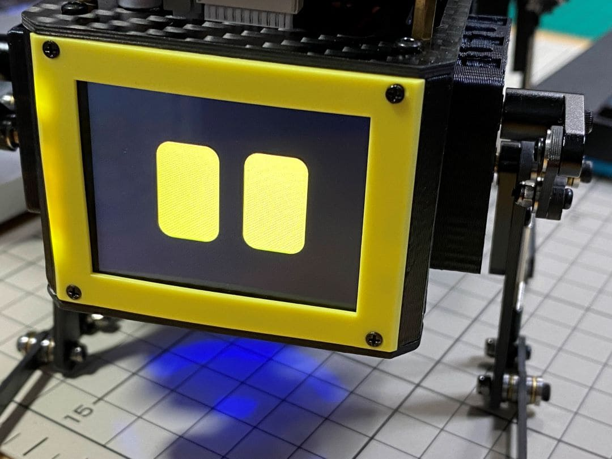

Step 1.2 Log in
^^^^^^^^^^^^^^^^^^^^^^^^^^^^^^^^^^^^^^^^

* Press ubuntu button on the screen to log in.
* Default username: ubuntu
* Default password: mangdang

Step 1.3 Set keyboard (Optional)
^^^^^^^^^^^^^^^^^^^^^^^^^^^^^^^^^^^^^^^^

* If you want to change the keyboard type, for an example, Japanese keyboard, you will need this setting. Press the menu button in the bottom left corner and type settings to bring up settings.

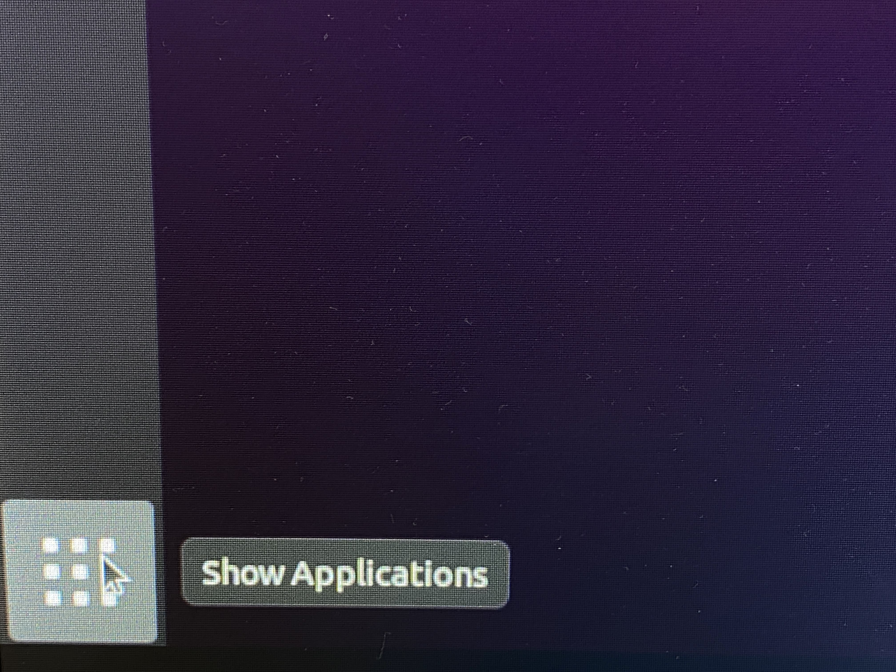

* Select Region & Language and press + for Input Sources. On the screen that comes up, select the three dots for other and type Japanese to select it. Type Japanese to select it.

Step 1.4 Open ports for ssh (Optional)
^^^^^^^^^^^^^^^^^^^^^^^^^^^^^^^^^^^^^^^^

* Attempt to make an ssh connection from your PC to Ubuntu.

::

	ssh ubuntu@192.168.x.x -p 22

* If you are unable to make an ssh connection from your PC, you will need to configure the following, maybe.

::

	sudo ufw allow 22
	sudo ufw reload

* If firewall is not running, do the following.

::

	sudo ufw enable

2. Calibration
-----------------

Step 2.1 Leg calibration (not for ROS image)
^^^^^^^^^^^^^^^^^^^^^^^^^^^^^^^^^^^^^^^^^^^^^
Please refer to the below calibration video clip.

.. raw:: html

    

        <iframe width="560" height="315" src="https://www.youtube.com/embed/lbnJb5Eb3gw?mute=1" frameborder="0" allow="accelerometer; autoplay; encrypted-media; gyroscope; picture-in-picture" allowfullscreen></iframe>
    

* During Mini Pupper calibration, if the servo horn assembly position is not right, it is not easy to calibrate, even break the servo.
  Please follow the below easy guide(not for ROS image).

* Make sure Mini Pupper is pre-assembled except the 4 legs.

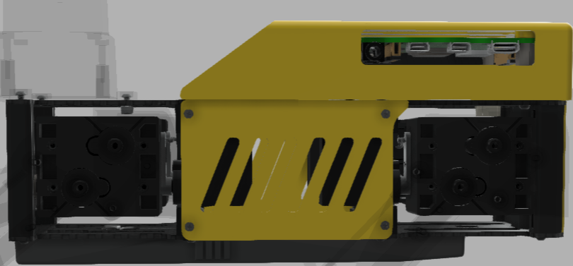

* Power on, double-click on the Calibration Tool icon on your desktop to launch it.

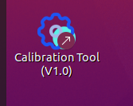

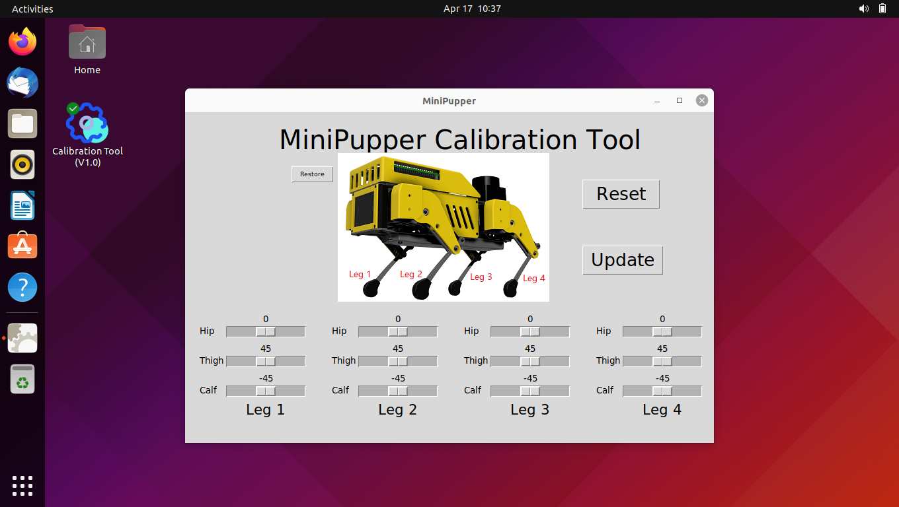

※ The calibration process is: calibrate each servo --> Press "Update" button to save the settings --> Press × to close and save the calibration.

※ Calibrate each servo by moving the bars or click the space position near the bars.

※ Reset button: when you hope to re-start from the last time.

※ Restore button: Restore factory settings and Press × to close.

* Use the calibration GUI tool to calibrate #1 #4 #7 #10 hip servos to the horizontal position.

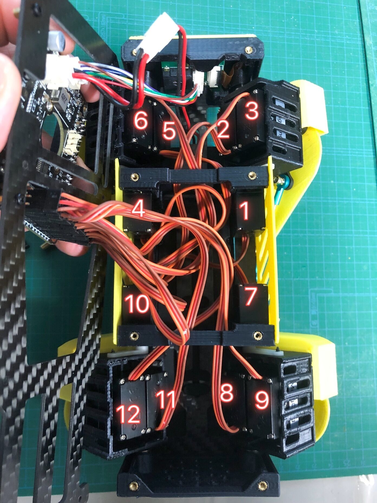

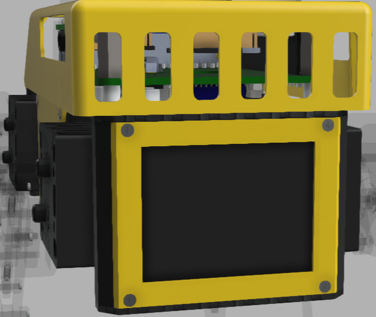

* Then assemble the 4 legs by hand at the right position as the below picture shows.

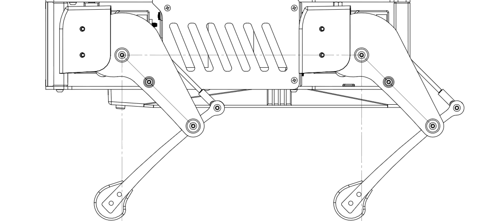

* Use the calibration GUI tool to optimize the legs position. For each leg, move the bars so that all the legs are at a 45 degree angle. The angle of the legs will change in conjunction with the position of the slide bar on the screen. However, if it does not move, then the steps you have followed are incorrect.

* You can use the iPhone's tilt sensor app, a ruler or a protractor to measure the angle. I also used a ruler and a protractor.

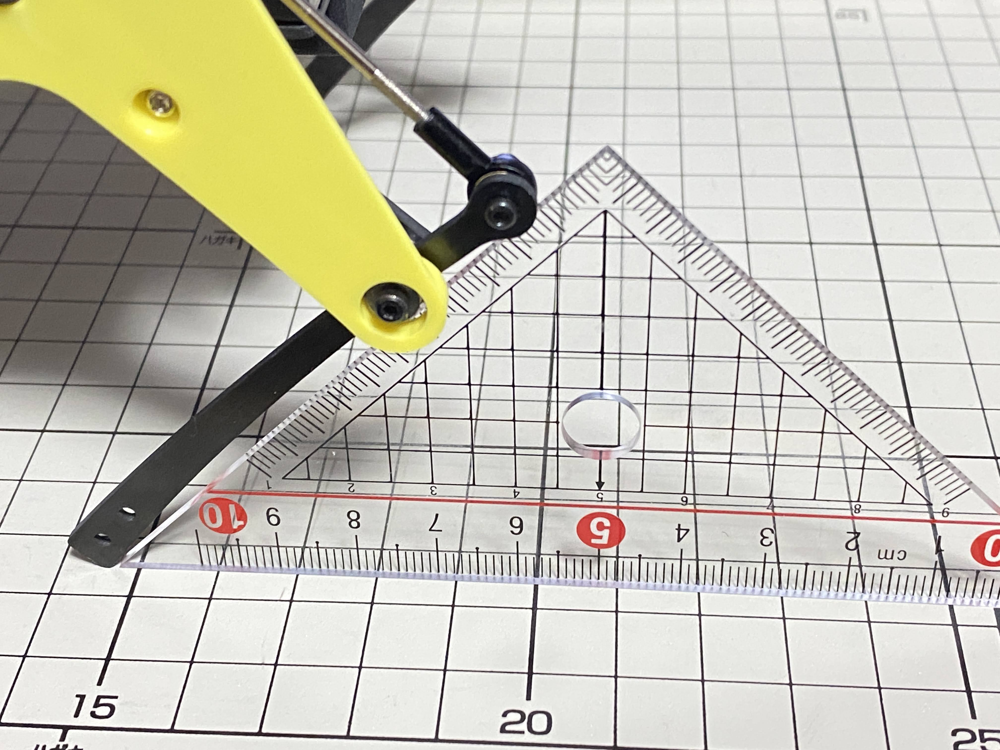

* It is a little bit difficult to measure the accurate inclination of the legs, so it is better to place the legs on a grid, like a piece of graph paper, to check that they are in the same position from front to back and from side to side, and to make any final adjustments.

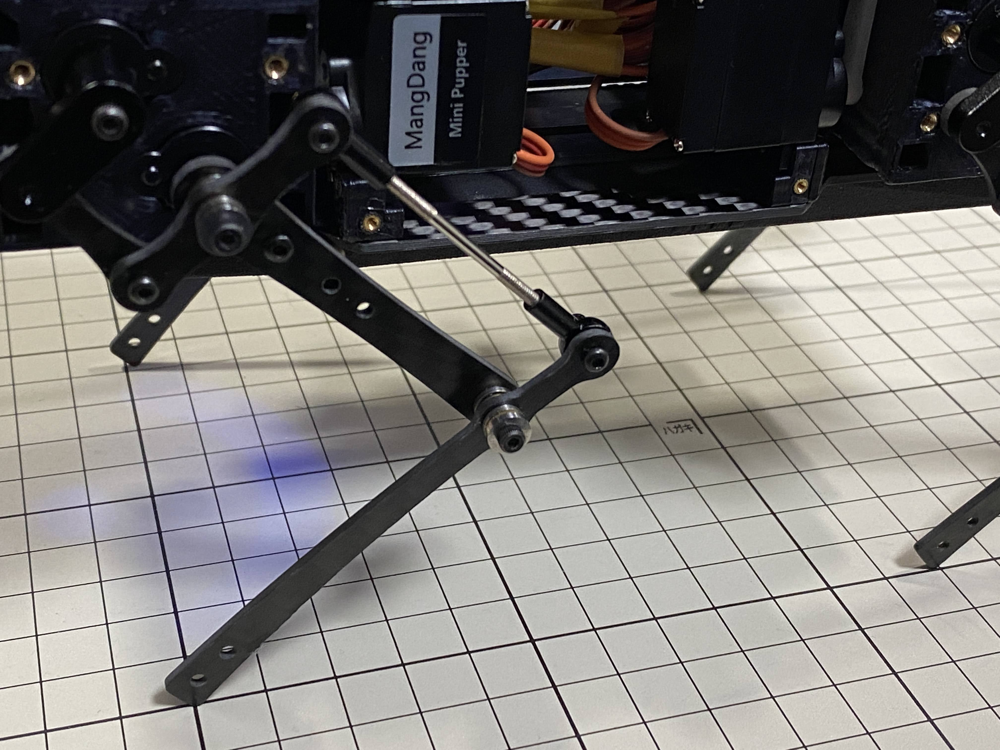

* When all legs are at 45° inclination as shown, press Update to save the settings. Press × to close the calibration application.

Step 2.2 Connect controller
^^^^^^^^^^^^^^^^^^^^^^^^^^^^^^^^^^^^^^^^

* Please check the next chapter.

* If you can control it with a controller, it's OK.

.. raw:: html

   

Software Calibration for Mini Pupper 2 and 2Pro
##################################################

1. Calibration Setup
--------------------

Tools
^^^^^^^^^^^^^^^^^^^^^^^^^^^^^^^^^^^^^^^^
For beginners, in addition to the tools included in the kit, the following items are required.

* USB keyboard
* HDMI display
* micro HDMI cable for connection between display and carry board

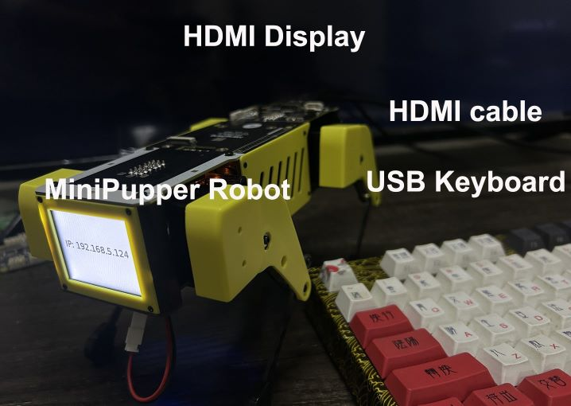

For beyond, you can use your PC to ssh to Mini Pupper to do everything, please refer to step 1.4

Step 1.1 Startup
^^^^^^^^^^^^^^^^

* Connect the carry board to the display with a microHDMI cable.
* Connect a USB keyboard to the carry board.
* Press and hold the battery button of the Mini Pupper for three seconds to boot up.
* If you can see Ubuntu running on your screen, you have succeeded. You should also see the IP address or "IP: no IPv4 address" on Mini Pupper display.

Step 1.2 Log in
^^^^^^^^^^^^^^^

* Press ubuntu button on the screen to log in.
* Default username: ubuntu
* Default password: mangdang

Step 1.3 Set your own WiFi
^^^^^^^^^^^^^^^^^^^^^^^^^^^^^^^^^^^^^^^^

* Edit the WiFi configure file(50-cloud-init.yaml), and set your WiFi to your own.

::

	sudo vi /etc/netplan/50-cloud-init.yaml
	# Edit and save
	sudo netplan apply
	sudo reboot

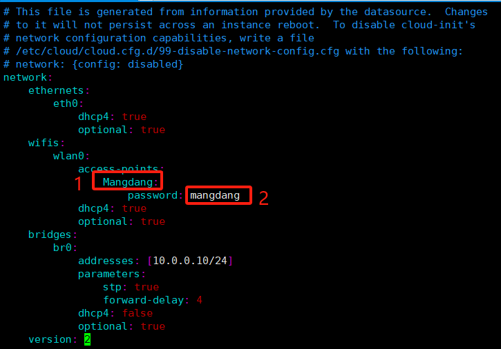

* You can also refer to `mini_pupper_web_controller <https://github.com/mangdangroboticsclub/mini_pupper_web_controller>`_

Step 1.4 Open ports for ssh without HDMI display
^^^^^^^^^^^^^^^^^^^^^^^^^^^^^^^^^^^^^^^^^^^^^^^^^^^

* Use your phone to set the default WiFi used by Mini Pupper.

    WiFi name: Mangdang

    Password:   mangdang

* Power on your robot and check the LCD display

    If the LCD shows “IP: no IPv4 address”, then reboot your robot again.

* After the LCD shows the IP address, make an ssh connection from your PC to your robot.

::

	ssh ubuntu@192.168.x.x

* If you are unable to make an ssh connection from your PC, you will need to configure the following, maybe.

::

	sudo ufw allow 22
	sudo ufw reload

* If firewall is not running, do the following.

::

	sudo ufw enable

2. Calibration
----------------

Step 2.1 Leg calibration
^^^^^^^^^^^^^^^^^^^^^^^^^
Please refer to the below calibration video clip.

.. raw:: html

    

        <iframe width="560" height="315" src="https://www.youtube.com/embed/96z3NyjY2t0?mute=1" frameborder="0" allow="accelerometer; autoplay; encrypted-media; gyroscope; picture-in-picture" allowfullscreen></iframe>
    

* Then assemble the 4 legs by hand at the right position as the below picture shows.

* It is a little bit difficult to measure the accurate inclination of the legs, so it is better to place the legs on a grid, like a piece of graph paper, to check that they are in the same position from front to back and from side to side, and to make any final adjustments.

* When all legs are at 45° inclination as shown, press "s" to save the settings. Press "q" to quite the calibration application.

Step 2.2 Use a web browser to run
^^^^^^^^^^^^^^^^^^^^^^^^^^^^^^^^^^^^^^^^

- Point a web browser to http://x.x.x.x:8080 where x.x.x.x is the IP address of your mini_pupper, such as, http://192.168.5.196:8080
- Click the “Activate” button of the "Controller" tab.
- Click the “Activate/Deactivate” button of the "Pupper" tab.
- Click the "≡" icon at the top left corner.
- Choose the "Walk" option.
- Click the "Walk/Rest" button.
- Use the scroll bar to control your Mini Pupper

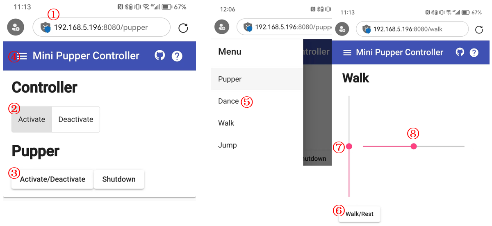
