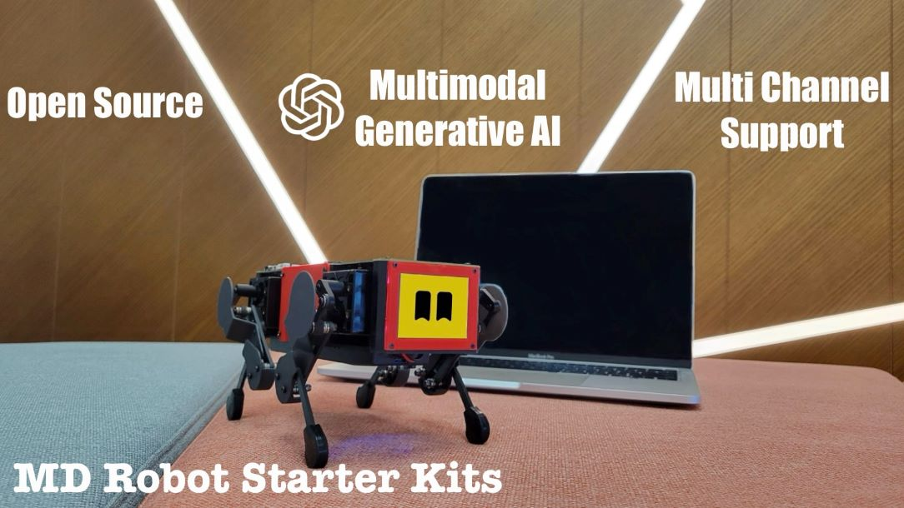

MD Robot Starter Kits User Manual
########################

Multimodal Generative AI, Open-source, ROS2, Robot Education Kit
------------
Our channels:  `FaceBook <https://www.facebook.com/groups/519009562699751>`_ , `Discord <https://discord.gg/xJdt3dHBVw>`_ , `Twitter <https://twitter.com/LeggedRobot>`_ , `FaceBook <https://www.facebook.com/afreez.gan/>`_ , `Github <https://github.com/mangdangroboticsclub/QuadrupedRobot/>`_

MD Robot Starter Kits will make robotics easier for schools, homeschool families, enthusiasts, and beyond.

Our new robots are `coming soon on Kickstarter <https://www.kickstarter.com/projects/mdrobotkits/md-robot-kits-open-source-support-your-genai-creativity>`_ !

.. raw:: html

    

        <iframe width="560" height="315" src="https://www.youtube.com/embed/dKmURq_CqeM?mute=1" frameborder="0" allow="accelerometer; autoplay; encrypted-media; gyroscope; picture-in-picture" allowfullscreen></iframe>
    

※ Key Features:

* Multimodal Generative AI: ChatGPT of OpenAI, Gemini of Google, and Claude of AWS. 
* ROS: support ROS1 & ROS 2 SLAM&Navigation.
* OpenCV: Deep learning based on camera.
* Open-source: DIY and custom what you want.
* Raspberry Pi & Arduino: it’s super expandable.

※ News:

* Sep. 2024: IEEE PHILADELPHIA SECTION MINIPUPPER WORKSHOP. 
* Dec. 2024: Multimodal Generative AI workshop in AWS re:Invent.
* Spring 2025, workshop in IEEE R1&R1 Student Activities Conference.

※ Global Events Before

.. raw:: html

    

        <iframe width="560" height="315" src="https://www.youtube.com/embed/hKPx-dp6_Hw?mute=1" frameborder="0" allow="accelerometer; autoplay; encrypted-media; gyroscope; picture-in-picture" allowfullscreen></iframe>  
    

What is MD Robot Starter Kits?
^^^^^^^^^^^^^^^^^^^^^

MD Robot Starter Kits include Mini Pupper 1(launched in 2021), Mini Pupper 2(launched in 2022), Mini Pupper 2G&2GA and Turtle robot(Coming soon!).

Mini Pupper, inspired by `Stanford Pupper <https://github.com/stanfordroboticsclub/StanfordQuadruped/>`_, is a low-cost, personal quadruped kit with open-source software. With MD Robot Starter Kits, you can build a robot dog that can drive around and have enough horsepower to create exciting applications.

Some useful links:

* `Mini Pupper Kickstarter Campaign <https://www.kickstarter.com/projects/336477435/mini-pupper-open-sourceros-robot-dog-kit>`_
* `Mini Pupper Makuake Campaign <https://www.makuake.com/project/mini_pupper/>`_
* `Mini Pupper 2 Kickstarter Campaign <https://www.kickstarter.com/projects/336477435/mini-pupper-2-open-source-ros2-robot-kit-for-dreamers>`_
* `Amazon AWS Robotics Blog <https://aws.amazon.com/blogs/robotics/build-and-simulate-a-mini-pupper-robot-in-the-cloud-without-managing-any-infrastructure/>`_
* `Amazon 2022 Dance Robot Workshops Guide <https://aws.amazon.com/blogs/robotics/build-and-simulate-a-mini-pupper-robot-in-the-cloud-without-managing-any-infrastructure/>`_
* `Amazon 2023 LLM(large language model) Workshops Guide <https://catalog.workshops.aws/ai-powered-dancing-robot/en-US/>`_

About MangDang Technology Co., Limited
^^^^^^^^^^^^^^^^^^^^^
Founded in 2020, MangDang specializes in the research, development, and production of robot products that make people's lives better. MangDang is headquartered in Hong Kong. We are a global team with members from many countries and regions.

We are all dreamers, and we look forward to connecting talents worldwide and innovating together to perform splendid times!

.. toctree::
    :maxdepth: 2
    :caption: Guide

    guide/Features
    guide/HowToOrder
    guide/QuickStartGuide
    guide/Assembly
    guide/SoftwareCalibration
    guide/ROS2Guide
    guide/MachineLearning
    guide/ReinforcementLearning
    guide/MultimodalGenAI
    guide/Examples

.. toctree::
    :maxdepth: 1
    :caption: References

    reference/Design
    reference/PCB
    reference/FAQ