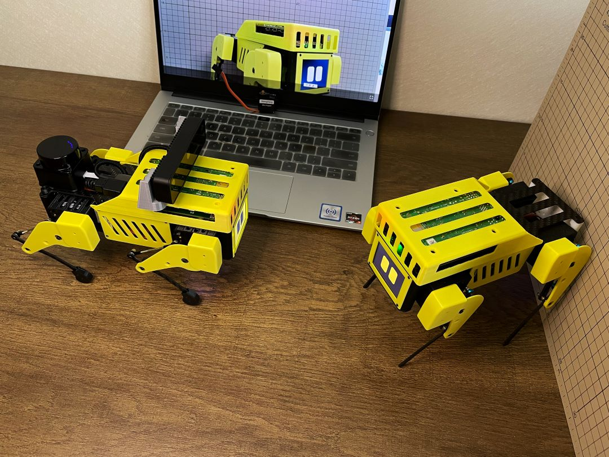
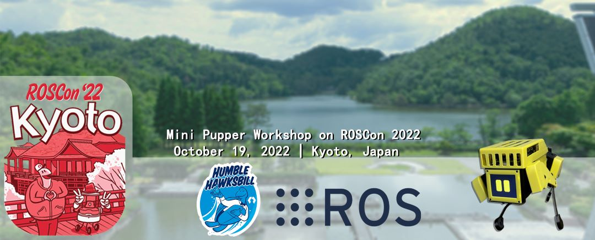

Mini Pupper User Manual
########################

Genuine,Robot Operating System,Open-source,Education Robot Kit
------------

    
.. image:: _static/000.png
    :align: center 

Mini Pupper will make robotics easier for schools, homeschool families, enthusiasts and beyond.

.. raw:: html

    

        <iframe width="560" height="315" src="https://www.youtube.com/watch?v=uLqRMl9Xppg" frameborder="0" allow="accelerometer; autoplay; encrypted-media; gyroscope; picture-in-picture" allowfullscreen></iframe>
    

What is Mini Pupper?
^^^^^^^^^^^^^^^^^^^^^

Mini Pupper is a low-cost, personal quadruped kit with open-source software. Mini Pupper was created by MANGDANG in Septemper 2021. With Mini Pupper, you’ll be able to build a robot dog that can drive around, and have enough horsepower to create exciting applications.

For more information, please refer to `Kickstarter Campaign <https://www.kickstarter.com/projects/336477435/mini-pupper-open-sourceros-robot-dog-kit>`_, `Makuake Campaign <https://www.makuake.com/project/mini_pupper/>`_, `Amazon AWS Robotics Blog <https://aws.amazon.com/blogs/robotics/build-and-simulate-a-mini-pupper-robot-in-the-cloud-without-managing-any-infrastructure/>`_, `Amazon 2022 re:MARS Workshop <https://aws.amazon.com/blogs/robotics/build-and-simulate-a-mini-pupper-robot-in-the-cloud-without-managing-any-infrastructure/>`_. Mini Pupper will have a full-day workshop on `ROSCon 2022 event <https://roscon.ros.org/2022/>`_.

.. |youtu.be-pre-assembled-user-guide| raw:: html

  <iframe width="560" height="315" src="https://www.youtube.com/watch?v=bUaszjfQXk4" title="YouTube video player" frameborder="0" allow="accelerometer; autoplay; clipboard-write; encrypted-media; gyroscope; picture-in-picture" allowfullscreen></iframe>

.. |youtu.be-pre-assembled-user-guide-ja| raw:: html

  <iframe width="560" height="315" src="https://www.youtube.com/watch?v=bUaszjfQXk4" title="YouTube video player" frameborder="0" allow="accelerometer; autoplay; clipboard-write; encrypted-media; gyroscope; picture-in-picture" allowfullscreen></iframe>

|youtu.be-pre-assembled-user-guide|

.. toctree::
    :maxdepth: 1
    :caption: Guide

    guide/Features
    guide/HowToOrder
    guide/QuickStartGuide
    guide/Assembly
    guide/Software
    guide/SLAM
    guide/Navigation
    guide/Simulation
    guide/MachineLearning
    guide/Examples

.. toctree::
    :maxdepth: 1
    :caption: References

    reference/MechanicalDesign
    reference/PCB
    reference/FAQ

Many guys are contributing to Mini Pupper project, some parts referred to other contributors' documents, many thanks for all the guys who helped Mini Pupper project!