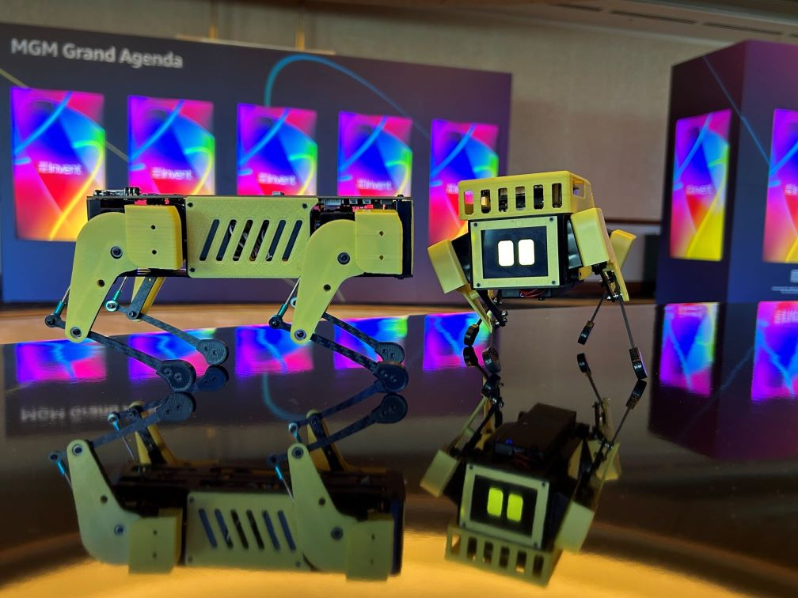
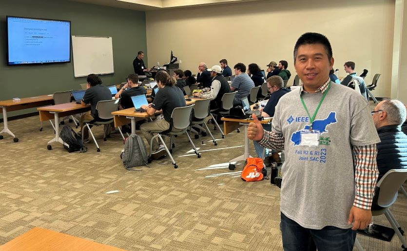

Mini Pupper User Manual
########################

ROS2, Open-source, Education Robot Kit
------------
Our channels:  `Discord <https://discord.gg/xJdt3dHBVw>`_ , `Twitter <https://twitter.com/LeggedRobot>`_ , `FaceBook <https://www.facebook.com/afreez.gan/>`_ , `Github <https://github.com/mangdangroboticsclub/QuadrupedRobot/>`_

Mini Pupper will make robotics easier for schools, homeschool families, enthusiasts, and beyond.

.. raw:: html

    

        <iframe width="560" height="315" src="https://www.youtube.com/embed/uLqRMl9Xppg?mute=1" frameborder="0" allow="accelerometer; autoplay; encrypted-media; gyroscope; picture-in-picture" allowfullscreen></iframe>
    

※ Key Features:

* AWS LLM(large language model) service can be built-in and released at the workshop of AWS re: Invent, NOV. 27 – DEC. 1, 2023 | LAS VEGAS, NV. 
* ROS: support ROS1 & ROS 2 SLAM&Navigation.
* OpenCV: support single camera and OpenCV official OAK-D-Lite 3D camera module.
* Open-source: DIY and custom what you want.
* Raspberry Pi: it’s super expandable, endorsed by Raspberry Pi.

※ Mini Pupper News:

* Mini Pupper will join CES 2024,  JAN. 9 – JAN. 12, 2024 | LAS VEGAS, NV. 
* Mini Pupper 2 competition will be held at the IEEE R1&R1 Student Activities Conference, in April 2024.

※ Mini Pupper Activities Before

* AWS LLM(large language model) service workshop at AWS re: Invent, NOV. 27 – DEC. 1, 2023 | LAS VEGAS, NV. 

.. raw:: html

    

        <iframe width="560" height="315" src="https://www.youtube.com/embed/vOrwDpxQAyQ?mute=1" frameborder="0" allow="accelerometer; autoplay; encrypted-media; gyroscope; picture-in-picture" allowfullscreen></iframe>  
    

* Mini Pupper 2 workshops at the Student Activities Conference (SAC) sponsored by IEEE Region 2 & Region 1, 21 Oct 2023.

* Mini Pupper workshops in 2022.

.. raw:: html

    

        <iframe width="560" height="315" src="https://www.youtube.com/embed/d_L2933gLxg?mute=1" frameborder="0" allow="accelerometer; autoplay; encrypted-media; gyroscope; picture-in-picture" allowfullscreen></iframe>  
    

What is Mini Pupper?
^^^^^^^^^^^^^^^^^^^^^

Mini Pupper, inspired by `Stanford Pupper <https://github.com/stanfordroboticsclub/StanfordQuadruped/>`_, is a low-cost, personal quadruped kit with open-source software. With Mini Pupper, you can build a robot dog that can drive around and have enough horsepower to create exciting applications.

Some useful links:

* `Mini Pupper Kickstarter Campaign <https://www.kickstarter.com/projects/336477435/mini-pupper-open-sourceros-robot-dog-kit>`_
* `Mini Pupper Makuake Campaign <https://www.makuake.com/project/mini_pupper/>`_
* `Mini Pupper 2 Kickstarter Campaign <https://www.kickstarter.com/projects/336477435/mini-pupper-2-open-source-ros2-robot-kit-for-dreamers>`_
* `Amazon AWS Robotics Blog <https://aws.amazon.com/blogs/robotics/build-and-simulate-a-mini-pupper-robot-in-the-cloud-without-managing-any-infrastructure/>`_
* `Amazon 2022 Dance Robot Workshops Guide <https://aws.amazon.com/blogs/robotics/build-and-simulate-a-mini-pupper-robot-in-the-cloud-without-managing-any-infrastructure/>`_
* `Amazon 2023 LLM(large language model) Workshops Guide <https://catalog.workshops.aws/ai-powered-dancing-robot/en-US/>`_

About MangDang Technology Co., Limited
^^^^^^^^^^^^^^^^^^^^^
Founded in 2020, MangDang specializes in the research, development, and production of robot products that make people's lives better. MangDang is headquartered in Hong Kong. We are a global team with members from many countries and regions such as the United States, Japan, Canada, Europe, China, and so on.

We are all dreamers, and we look forward to connecting talents worldwide and innovating together to perform splendid times!

.. toctree::
    :maxdepth: 1
    :caption: Guide

    guide/Features
    guide/HowToOrder
    guide/QuickStartGuide
    guide/Assembly
    guide/AssembleMiniPupper2
    guide/AssembleMiniPupper2Pro
    guide/Software
    guide/SoftwareCalibration.MP2
    guide/SLAM
    guide/Navigation
    guide/Simulation
    guide/MachineLearning
    guide/Examples

.. toctree::
    :maxdepth: 1
    :caption: References

    reference/Design
    reference/PCB
    reference/FAQ