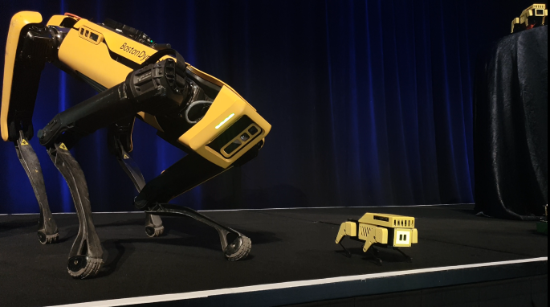

=======================
Mini Pupper User Manual
=======================

Welcome to the official user manual for Mini Pupper, a low-cost, open-source personal quadruped robot dog kit. This documentation will guide you through assembly, calibration, and advanced AI/ROS programming.

* **Official Store**: `Online Shop <https://mangdang.store/collections/shop>`_
* **Developer Communities**: `Github <https://github.com/mangdangroboticsclub?tab=repositories>`_ | `Discord <https://discord.gg/xJdt3dHBVw>`_
* **Social Media**: `X <https://x.com/leggedrobot>`_ | `FaceBook <https://www.facebook.com/groups/519009562699751>`_ | `Youtube <https://youtube.com/@MangDangRobotics>`_ | `Instagram <https://www.instagram.com/minirobotdog/>`_ | `Reddit <https://www.reddit.com/r/PhysicalAIRobot/>`_ 

Introduction
----------------

What is Mini Pupper?
==========================
Inspired by `Stanford Pupper <https://github.com>`_, Mini Pupper makes robotics and AI accessible with open-source software and expandable hardware. With our kits, you can build a robot dog with enough horsepower to create exciting real-world applications.

Our expanding hardware ecosystem includes:
* **Mini Pupper 1** (Launched in 2021)
* **Mini Pupper 2** (Launched in 2022)
* **AI Kit** (Launched in 2026)

|

Key Features
==========================
* **Mechanics**: Quickly assemble and understand mechanical design within 1 hour.
* **Scratch Coding**: The easiest start for K12 STEM education.
* **Robotics Control**: Ready-to-study kinematics examples out of the box.
* **ROS (Robot Operating System)**: Study SLAM and navigation with example projects (ROS1 & ROS2).
* **OpenCV**: Vision tutorials using the built-in camera module and OpenCV.
* **Generative AI**: Integrated with ChatGPT (OpenAI), Gemini (Google), and Claude (AWS).
* **Open-Source & Expandable**: Fully customizable DIY hardware, officially endorsed by Raspberry Pi.

Documentation
---------------

User Guides
==========================
.. toctree::
   :maxdepth: 1

   guide/Features
   guide/HowToOrder
   guide/QuickStartGuide
   guide/Assembly/index
   guide/SoftwareCalibration
   guide/ROS2Guide
   guide/MachineLearning
   guide/ReinforcementLearning
   guide/MultimodalGenAI
   guide/Examples

Technical References
==========================
.. toctree::
   :maxdepth: 1

   reference/Design
   reference/PCB
   reference/FAQ

About Us
-------------

MangDang Technology Co., Limited
=======================================
Founded in 2020 and headquartered in Hong Kong, MangDang specializes in the research, development, and production of innovative robot products that improve daily life. We are a global team with members from many countries and regions.

Global Community & Events
==========================
Explore Mini Pupper in action across Ubuntu, ROS, AWS, and IEEE：

.. raw:: html

   

        <iframe width="685" height="385" src="https://www.youtube.com/embed/hKPx-dp6_Hw?mute=1" frameborder="0" allow="accelerometer; autoplay; encrypted-media; gyroscope; picture-in-picture" allowfullscreen></iframe>
    

|

*Special thanks to our Japanese translation contributors:* `naraki <https://github.com/naraki>`_ , `Tech Life Hacking <https://github.com/tech-life-hacking>`_ , `Tiryoh (Daisuke Sato) <https://github.com/Tiryoh>`_

