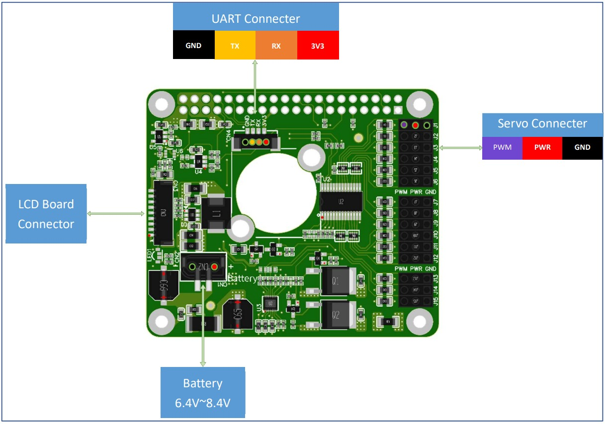
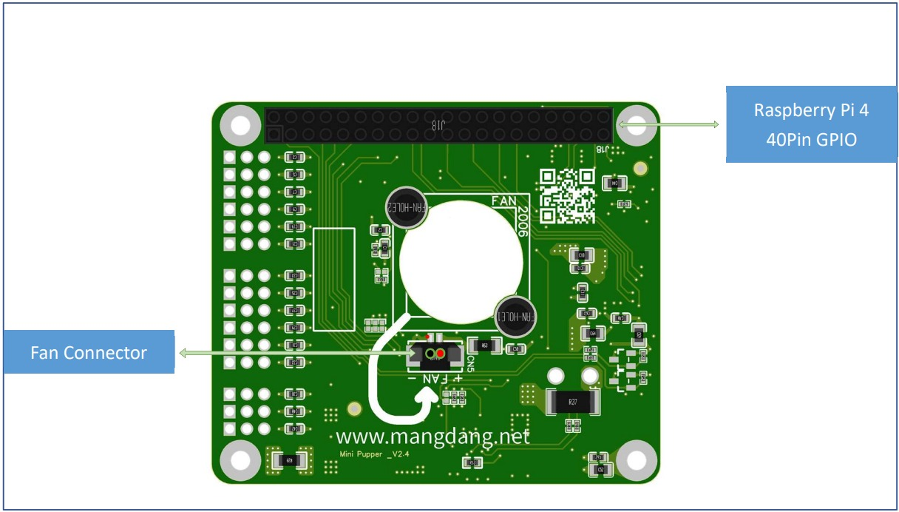

=================
PCB
=================

.. contents::
  :depth: 2

PCB Design
-----------------

For Mini Pupper custom board design, please refer to the below pictures.
You can also find the detailed `Schematic and Datasheet <https://drive.google.com/drive/folders/12FDFbZzO61Euh8pJI9oCxN-eLVm5zjyi>`_ .

Top side
^^^^^^^^^^^^^^^^^^^^^^^^^^^^^^^^^^^^^^^^

Bottom side
^^^^^^^^^^^^^^^^^^^^^^^^^^^^^^^^^^^^^^^^

